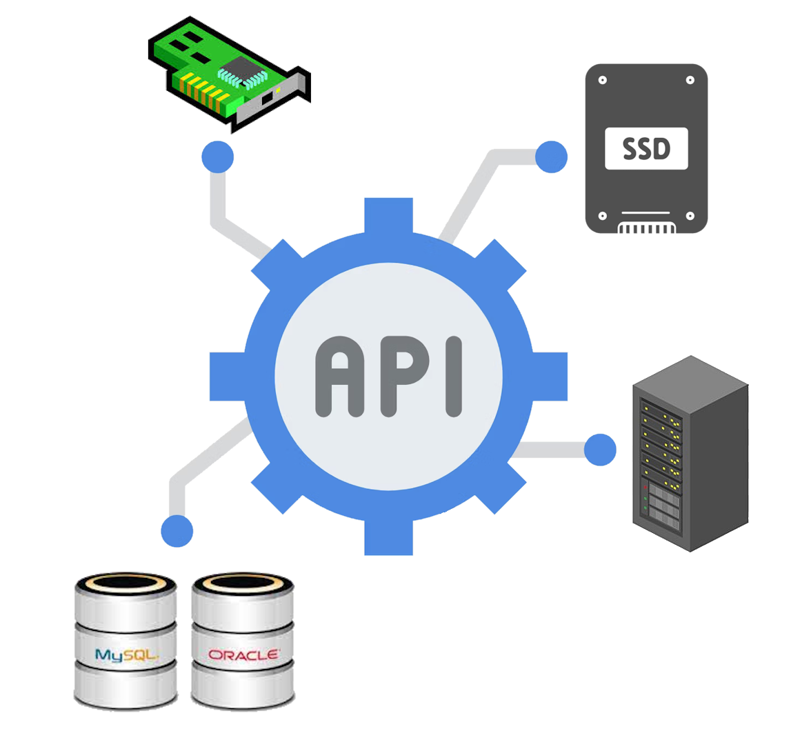
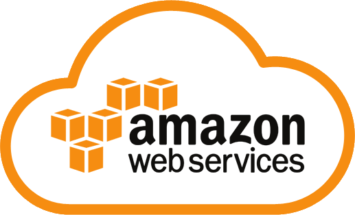
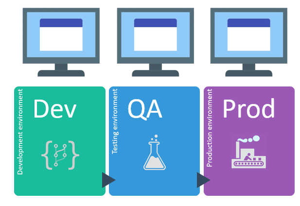
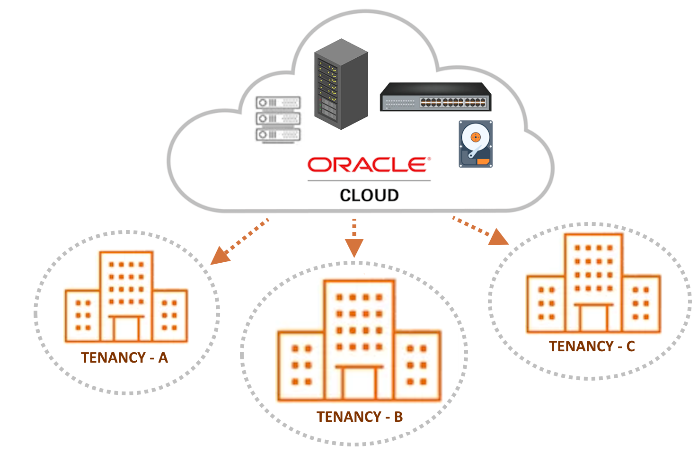
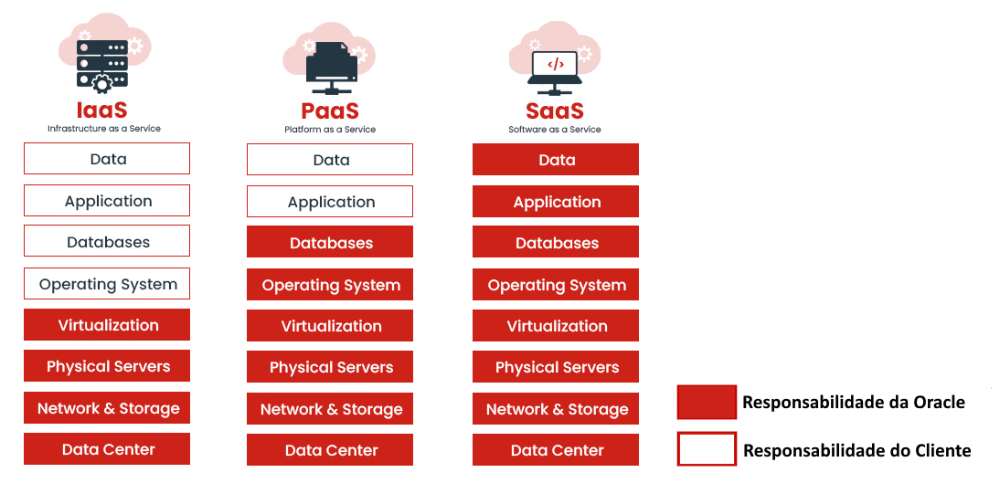
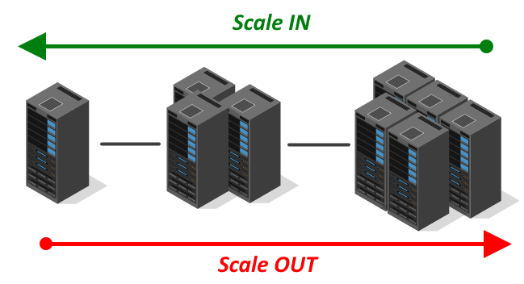
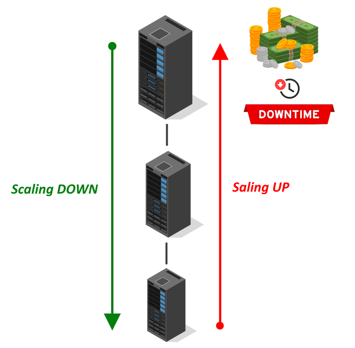
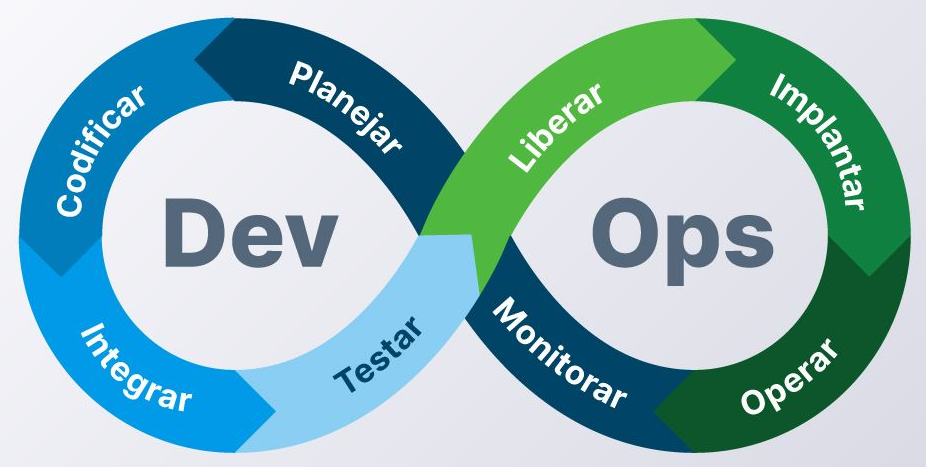
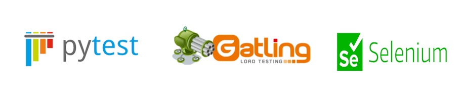
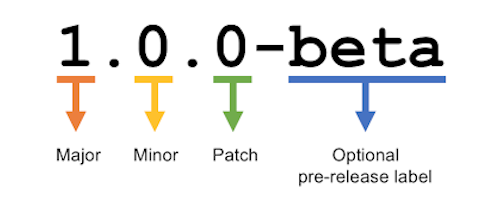

# 1.1 O que é Computação em Nuvem?

_"A verdadeira disrupção não acontece em seu data center, mas sim na nuvem." - Autor: Anônimo_

## 1.2 Um pouco de História

Explicar o que é _Computação em Nuvem_ torna-se mais claro quando se compreende os motivos que levaram à sua criação. A forma moderna da Computação em Nuvem surgiu na _[Amazon](https://en.wikipedia.org/wiki/Amazon_(company))_, quando empresa percebeu a necessidade de criar recursos de TI de maneira ágil, para atender à crescente demanda de seu e-commerce.

Essa necessidade impulsionou a empresa a buscar soluções que permitissem escalar rapidamente sua infraestrutura, resultando na inovação que conhecemos hoje como Computação em Nuvem.

>_**__NOTA:__** Outras empresas também desempenharam papéis pioneiros e significativos no desenvolvimento e na popularização da computação em nuvem. O texto destaca a Amazon, pois ela foi uma das primeiras plataformas a oferecer serviços de Computação em Nuvem de maneira abrangente e acessível._

A Amazon foi fundada por _[Jeff Bezos](https://en.wikipedia.org/wiki/Jeff_Bezos)_ em 1994, começando sua trajetória como uma _livraria online_. Bezos teve a ideia de colocar a venda na Internet, uma quantidade enorme de livros num volume comparável, na sua cabeça, à quantidade de água do rio Amazonas.

Para Jeff Bezos, que na época tinha 31 anos, vender livros online era uma oportunidade promissora, pois poderia ser feito por meio de uma _loja virtual_ praticamente sem a necessidade de manter estoque. A estratégia consistia em encomendar aos distribuidores apenas as unidades efetivamente compradas pelos clientes. Além disso, Bezos acreditava que os livros eram produtos fáceis de vender e transportar, e que poderiam ser adquiridos por impulso, o que tornava o modelo de negócios ainda mais atraente.

Com o passar do tempo, a empresa começou a enfrentar desafios significativos relacionados à sua infraestrutura de TI. Com o rápido aumento no número de clientes e pedidos, tornou-se cada vez mais difícil melhorar o desempenho do seu site e a eficiência de suas operações.

O aumento da demanda na livraria online, especialmente durante períodos de pico como as festas de fim de ano, frequentemente resultava em lentidão e falhas no sistema, resultando em perdas significativas de vendas.

Além da Amazon, por volta do ano 2000, diversas startups de diferentes setores estavam rapidamente surgindo, crescendo e se proliferando. No entanto, nenhum data center da época estava preparado para atender a essa demanda crescente.

De fato, o mundo de infraestrutura de TI não estava preparado para acompanhar esse crescimento acelerado. Os recursos de TI precisavam ser criados e disponibilizados para uso de forma rápida, com custos acessíveis e sem a burocracia imposta pelos processos _[ITIL](https://en.wikipedia.org/wiki/ITIL)_ da época.

Na Amazon e no ecossistema de startups da época, cada novo projeto demandava muito tempo apenas para configurar a infraestrutura, a rede, as máquinas e os bancos de dados. Sempre que era necessário utilizar esse conjunto de recursos para um novo projeto, era preciso reconstruir e reconfigurar tudo do zero.

Startups são frequentemente fundadas em cenários de incerteza, representando negócios que podem ter sucesso ou fracassar. Elas lançam softwares e crescem rapidamente, testando suas ideias no mercado na esperança de obter lucro. Agora, imagine se esse tipo de empresa tivesse que adquirir todo o hardware de TI antecipadamente, apenas para descobrir posteriormente que o negócio não deu certo. 

Pare e reflita por um momento, considerando apenas a infraestrutura: **_"Qual é o custo para uma empresa adquirir e manter o hardware, além de contar com um profissional responsável por criar, configurar e gerenciar a infraestrutura de TI durante toda a vida útil de sua aplicação?"_**

Para enfrentar esses desafios, a Amazon investiu em servidores, data centers e tecnologias de software para aprimorar a escalabilidade e a confiabilidade de suas operações. A empresa começou a desenvolver soluções internas que permitiam a criação de toda a infraestrutura por meio de _[APIs REST](https://en.wikipedia.org/wiki/REST)_, possibilitando que seus desenvolvedores provisionassem e gerenciassem recursos de forma programática.

Isso foi um marco na época, pois significava que qualquer usuário poderia criar, modificar e excluir recursos de TI, como servidores, armazenamento e bancos de dados, por meio de chamadas de API, em vez de depender de processos manuais.

Com base nessa experiência adquirida, a Amazon identificou a oportunidade de criar e oferecer um serviço que automatizasse e gerenciasse todos os recursos de TI, eliminando a necessidade de reconstruir tudo do zero repetidamente. Isso possibilitou que empresas de todos os tamanhos criassem e acessassem recursos de computação de forma escalável e econômica. Assim, as empresas passaram a se preocupar menos com a compra de hardware e mais com a contratação de serviços.

Foi nesse contexto que, em 2006, a Amazon lançou a _[AWS (Amazon Web Services)](https://en.wikipedia.org/wiki/Amazon_Web_Services)_ ao público, oferecendo serviços que permitiam a criação de infraestrutura por meio da web.

As tecnologias introduzidas pela _AWS_ tornaram possível algo que antes era extremamente desafiador: **_destruir e recriar máquinas em questão de segundos_**. 

Esse modelo permitiu que desenvolvedores, mesmo sem experiência em criação de infraestrutura, provisionassem máquinas rapidamente e disponibilizassem suas aplicações para o mundo. Assim, surgiu a _Infraestrutura como Serviço (IaaS - Infrastructure as a Service)_, que passou a tratar a infraestrutura de TI como software.

Além de oferecer _Infraestrutura como Serviço (IaaS)_, a AWS trouxe um diferencial significativo em relação aos _[VPS (Servidores Virtuais Privados)](https://en.wikipedia.org/wiki/Virtual_private_server)_ da época: a implementação de um modelo inovador de **_cobrança e controle_**. 

Em vez de pagar uma mensalidade fixa, os usuários passaram a adotar um sistema de pagamento baseado em **_horas de uso_**, que ficou conhecido depois como _[Pay-As-You-Go (PAGY)](https://www.oracle.com/industries/payg-services-price-list/)_.

")

Pagar apenas pelas horas de uso trouxe uma flexibilidade significativa. Se você precisasse de uma máquina maior por um determinado período, bastava fazer a alteração e, em seguida, retornar para uma máquina menor, pagando apenas pelas horas utilizadas de acordo com o tamanho da máquina. 

Ficou fácil criar e recriar ambientes de teste separados dos ambientes de produção, permitindo que uma máquina fosse mantida ligada apenas durante o horário de expediente e desligada, se necessário, nos finais de semana. Essa abordagem não apenas proporcionou agilidade, mas também resultou em uma redução significativa nos custos associados à infraestrutura de TI.

Por fim, esse novo modelo de provisionamento de infraestrutura foi aprimorado e replicado em várias regiões geográficas ao redor do mundo, em diferentes data centers. Isso possibilitou que grandes empresas escalassem rapidamente suas operações e oferecessem serviços mais próximos de seus usuários finais.

Assim, surgiu o que passou a ser conhecido como _Computação em Nuvem_, uma inovação que beneficiaria o mundo.

Em 2010, a Computação em Nuvem se expandiu rapidamente, com a introdução de novos modelos de serviço, como _Plataforma como Serviço (Platform as a Service - PaaS)_ e _Software como Serviço (Sofware as a Service - SaaS)_. Outras empresas, como Oracle, Google, Microsoft e IBM, também ingressaram no mercado, oferecendo suas próprias soluções em nuvem.

Hoje, a Computação em Nuvem é uma parte fundamental da infraestrutura de TI, permitindo que empresas de todos os tamanhos acessem recursos computacionais de forma rápida, escalável e flexível, pagamento somente pelo uso que é feito.

## 1.3 Definições do NIST

Como você viu na seção anterior, a Computação em Nuvem, ou Cloud Computing, não é um conceito recente. Nesta seção, apresentaremos um conjunto de definições formais que contribuirão para um entendimento mais abrangente dessa tecnologia.

Um documento que detalha os conceitos relacionados à definição de Computação em Nuvem é o _["The NIST Definition of Cloud Computing"](https://csrc.nist.gov/pubs/sp/800/145/final)_, publicado em setembro de 2011. Esse documento é amplamente reconhecido como uma referência essencial na área de Computação em Nuvem.

De acordo com o NIST, a Computação em Nuvem é um modelo que possibilita o acesso, por meio da Internet, a um conjunto de recursos computacionais (como rede, armazenamento, servidores e serviços) que podem ser rapidamente criados e liberados de maneira simples, sem a necessidade de intervenção humana, como, por exemplo, ligar para um helpdesk para solicitar a criação de um servidor.

O NIST também especifica que um provedor de Computação em Nuvem deve apresentar _cinco características essenciais_. Além disso, o usuário que consome os serviços deve ser capaz de implantar sua aplicação ou provisionar sua infraestrutura, utilizando um dos _três modelos de serviço_ disponíveis (IaaS, PaaS ou SaaS), escolhendo entre um dos _modelos de implementação_ (nuvem pública, privada, híbrida ou comunitária).

Iniciaremos com a descrição das _cinco características essenciais_ que todo provedor de nuvem deve obrigatóriamente ter para ser reconhecido como um verdadeiro provedor de serviços em nuvem. Em seguida, abordaremos os _três tipos de serviços disponíveis_ e, por fim, discutiremos os _quatro modelos de implantação_.

### 1.3.1 Cinco Características Essenciais

Estas são as características essenciais que devem estar presentes quando se trata de Computação em Nuvem. Em essência, um provedor de serviços que oferece Computação em Nuvem deve, no mínimo, possuir as seguintes características essenciais:

#### On-demand self-service (Serviço sob demanda)

Um usuário que consome serviços em nuvem pode criar servidores, redes, bancos de dados e outros recursos conforme a sua necessidade, tudo isso por meio da rede, sem precisar de qualquer intervenção humana por parte do provedor de nuvem.

#### Broad Network Access (Amplo Acesso à Rede)

Os recursos computacionais estão disponíveis por meio da rede e devem ser acessíveis através de mecanismos padronizados, permitindo seu uso em dispositivos como celulares, tablets, laptops e estações de trabalho.

A expressão _"mecanismos padronizados"_ refere-se a métodos, protocolos ou interfaces que são amplamente aceitos e utilizados na indústria, que garantem a comunicação e a operação eficaz entre diferentes sistemas e serviços. Nesse contexto, podemos citar o protocolo TCP/IP, que é universalmente adotado, padronizado por meio de documentos RFC (Request for Comments) e implementado pela maioria dos sistemas operacionais disponíveis. Em outras palavras, o uso do protocolo TCP/IP serve como um meio padronizado para criar ou acessar os recursos oferecidos pelo provedor de nuvem.

#### Resource Pooling (Agrupamento de Recursos)

Os recursos computacionais de um provedor de nuvem são agrupados para atender a múltiplos clientes, que permanecem isolados uns dos outros, por meio de um modelo conhecido como _multi-tenant_ (multilocatário). 

Empresas ou indivíduos pagam para acessar um _pool virtual de recursos compartilhados_, incluindo serviços de computação, armazenamento e rede, que estão localizados em servidores remotos, pertencentes e gerenciados por provedores de serviços. 

Os diferentes recursos, tanto físicos quanto virtuais, são dinamicamente atribuídos e reatribuídos conforme a demanda do cliente. Geralmente, o cliente não tem controle ou conhecimento sobre a localização exata dos recursos fornecidos pelo provedor de nuvem. 

Por exemplo, no OCI ao escolher a região _"Brazil East (São Paulo)"_, o usuário é informado de que seus recursos serão criados no Brasil, especificamente em alguma das cidades da grande _São Paulo_. No entanto, não é possível identificar em qual datacenter esses recursos estarão alocados.

#### Rapid Elasticity (Elasticidade Rápida)

Os recursos computacionais do provedor de nuvem podem ser rapidamente criados e liberados de maneira elástica, e, em alguns casos, de forma automática, em resposta à demanda de utilização.

Para o consumidor, há a percepção de que os recursos são ilimitados e podem ser ampliados rapidamente; no entanto, é fundamental que essa expansão esteja, evidentemente, associada a custos.

#### Measured Service (Serviço Medido)

Refere-se à capacidade que um provedor de serviços em nuvem possui para monitorar e relatar a utilização dos recursos de TI por seus consumidores de maneira transparente. O provedor realiza a cobrança com base no que é medido ou efetivamente consumido, garantindo que essa informação seja clara e de fácil visualização tanto para o consumidor dos serviços quanto para o próprio provedor de nuvem.

Por exemplo, é responsabilidade do provedor de nuvem esclarecer como é realizada a cobrança de uma máquina virtual. Nesse caso, a cobrança pode ser baseada na quantidade de horas em que a máquina virtual permanece ativa ou na quantidade de dias em que está em uso.

### 1.3.2 Modelos de Serviços (Service Models)

Um provedor de nuvem, de acordo com a especificação do NIST, deve ser capaz de oferecer serviços em _três modalidades distintas_. Essa especificação não apenas detalha o que cada modalidade oferece ao consumidor, mas também esclarece as responsabilidades tanto do consumidor (você) quanto do provedor de nuvem (Oracle).

>_**__NOTA:__** Para maiores informações sobre as responsabilidades que envolve o uso da nuvem entre você e a Oracle, consulte [Modelo de Responsabilidade Compartilhada para Resiliência](https://docs.oracle.com/pt-br/iaas/Content/cloud-adoption-framework/oci-shared-responsibility.htm)._

#### IaaS - Infrastructure as a Service (Infraestrutura como Serviço)

É a capacidade que um provedor de serviços em nuvem tem de oferecer uma infraestrutura de processamento (compute), armazenamento (storage) e rede (network). Dessa forma, o cliente não precisa se preocupar em gerenciar a virtualização, a infraestrutura física (como cabeamento, ar condicionado, energia elétrica, entre outros) ou os dispositivos de rede (switches e roteadores).

No contexto do serviço de _[Compute](https://docs.oracle.com/en-us/iaas/Content/Compute/Concepts/computeoverview.htm)_ no OCI, classificado como IaaS, ao criar uma instância, o sistema operacional é pré-instalado. A partir daí, o cliente tem a liberdade de instalar o que desejar; no entanto, a administração total do sistema operacional, incluindo atualizações de software, segurança e gerenciamento de usuários, é de responsabilidade do cliente, e não do provedor de nuvem.

#### PaaS - Platform as a Service (Plataforma como Serviço)

O provedor de nuvem oferece uma plataforma que permite aos usuários executar, desenvolver e gerenciar aplicações. Em outras palavras, o modelo PaaS disponibiliza tecnologias para os desenvolvedores desenvolver suas aplicações.

O modelo também abstrai os detalhes da infraestrutura subjacente, como rede, virtualização e sistema operacional. Isso significa que o cliente não tem acesso direto ao sistema operacional ou ao hardware, e não precisa se preocupar com atualizações de software, por exemplo. Como resultado, esse modelo se torna mais fácil de operar e mais econômico em comparação ao IaaS.

Um exemplo de serviço de plataforma é o [OCI Functions](../chapter-5/functions.md), que será abordado posteriormente. Ao utilizar o Functions, você é responsável apenas pelo _código da sua função_, enquanto a criação da infraestrutura computacional necessária para executá-la fica a cargo do OCI. Isso inclui a configuração da rede, a criação das máquinas virtuais para rodar o código, o download do contêiner, entre outros.

#### SaaS - Software as a Service (Software como Serviço)

São aplicativos hospedados na nuvem que funcionam sem a necessidade de download ou instalação local. Toda a infraestrutura necessária para a execução do software — desde o gerenciamento do hardware e do sistema operacional até a própria aplicação — é gerenciada pelo provedor de nuvem. O cliente é responsável apenas pela configuração, personalização para atender às suas necessidades e uso do software.

A Oracle oferece uma ampla gama de soluções empresariais no modelo SaaS, incluindo o [Oracle ERP Cloud](https://www.oracle.com/erp-4/), [Oracle HCM Cloud](https://www.oracle.com/human-capital-management-4/), [Oracle CX Cloud](https://www.oracle.com/cx/platform/) e [Oracle SCM Cloud](https://www.oracle.com/scm-4/), entre outras.

Todas essas soluções são softwares prontos para uso e acessíveis através de um navegador web. Você pode personalizar o software para atender às suas necessidades específicas, sem qualquer interação com a infraestrutura computacional subjacente utilizada pelo software.

### 1.3.3 Modelos de Implantação (Deployment Models) 

Os modelos de implantação definem as diferentes maneiras pelas quais a infraestrutura de nuvem pode ser provisionada.

#### Nuvem Pública

A infraestrutura da Computação em Nuvem é disponibilizada e comercializada para o público em geral. Este é o modelo mais amplamente utilizado e oferecido por grandes corporações, como a Oracle.

#### Nuvem Privada

A infraestrutura da Computação em Nuvem é destinada ao uso exclusivo de uma única organização. As tecnologias em nuvem são implementadas em ambientes controlados, onde tanto o provedor quanto o consumidor pertencem à mesma entidade.

Em outras palavras, a Private Cloud é um modelo em que os serviços de nuvem são fornecidos dentro de uma infraestrutura privada.

Um exemplo é o _[OCI Dedicated Region](https://www.oracle.com/cloud/cloud-at-customer/dedicated-region/)_, também conhecido como _Oracle Dedicated Region Cloud@Customer_. Essa solução da Oracle permite que as organizações implementem uma região completa da Oracle Cloud em suas próprias instalações ou em um data center específico.

>_**__NOTA:__** Para maiores informações consulte ["Dedicated Region"](https://www.oracle.com/cloud/cloud-at-customer/dedicated-region/)._

#### Nuvem Híbrida

A infraestrutura da Computação em Nuvem geralmente é composta por duas ou mais nuvens (privada, comunitária ou pública) interconectadas entre si.

Um exemplo é o ["Oracle Cloud at Customer"](https://www.oracle.com/cloud/cloud-at-customer/), que implementa toda a tecnologia de Computação em Nuvem diretamente no datacenter do cliente. Além disso, essa solução se conecta aos serviços de nuvem pública da Oracle.

#### Nuvem Comunitária

A infraestrutura da Computação em Nuvem é utilizada por uma comunidade específica de clientes de diferentes organizações que compartilham interesses comuns. A administração da nuvem comunitária é geralmente realizada por administradores da própria comunidade, embora em alguns casos possa ser gerenciada por um terceiro.

## 1.4 Outras definições sobre Computação em Nuvem

Algumas definições adicionais que ajudam a esclarecer o conceito de Computação em Nuvem:

- **[2008, Gartner](https://www.gartner.com/en/documents/697413)**

    - _"...um estilo de computação no qual recursos escaláveis e elásticos habilitados para TI, são fornecidos como um serviço a clientes externos que usam tecnologias da Internet."_

- **[Forrester Research](https://www.forrester.com/blogs/09-10-02-assessing_the_maturity_of_cloud_computing_services/)**

    - _"...capacidades de TI padronizadas (serviços, software ou infraestrutura) entregues via tecnologias da Internet em um modelo de self-service no qual se paga somente por aquilo que é usado."_

- **[Cloud Computing: Concepts, Technology & Architecture. Prentice Hall, 2013](https://amzn.to/3POEJZE)**

    - _"A computação em nuvem é uma forma especializada de computação distribuída que introduz modelos de utilização para provisionar remotamente recursos escaláveis e medidos."_

- **[Revistausp, n. 97 (2013): COMPUTAÇÃO EM NUVEM ](https://www.revistas.usp.br/revusp/issue/view/5058)**

    - _"Grosso modo, seria possível definir “nuvem” como a possibilidade de acessarmos qualquer dado – seja arquivo, programa e serviço – de qualquer lugar do planeta, a qualquer hora do dia."_

- **Definição Genérica**

    - _"Computação em Nuvem é um modelo computacional que permite escalar o seu negócio, pagando apenas pelos recursos utilizados."_

## 1.5 Terminologias da Computação em Nuvem

A seguir, são apresentados alguns termos comuns relacionados aos benefícios e funcionalidades da Computação em Nuvem:

### 1.5.1 Alta disponibilidade (High Availability - HA)

Ambientes computacionais configurados para estarem sempre disponíveis (24 horas por dia, 7 dias por semana, 365 dias por ano). Esses ambientes contam com hardware redundante e uma arquitetura de software projetada para alta disponibilidade, eliminando pontos únicos de falha. Em caso de qualquer falha, componentes de backup são acionados de forma transparente, garantindo que não haja impacto para o usuário final.

### 1.5.2 Tolerante a falhas (Fault Tolerance)

Descreve como um provedor de Computação em Nuvem assegura um nível mínimo de indisponibilidade para os serviços oferecidos aos seus consumidores.

>_**__NOTA:__** Consulte [Objetivos de Nível de Serviço para Serviços de Nuvem Pública Oracle PaaS e IaaS](https://docs.oracle.com/pt-br/iaas/Content/General/Reference/servicelevelobjectives.htm) para obter mais informações sobre os tempos de SLA dos serviços disponíveis no OCI._

### 1.5.3 Escalabilidade (Scalability)

Representa a capacidade de um recurso de TI de se adaptar a variações na demanda de uso, seja ela crescente ou decrescente.

Existem diferentes tipos de escalabilidade dos serviços, que incluem:

#### Scaling Out/In

Conhecida como _escalabilidade horizontal_, essa abordagem envolve a alocação ou liberação de recursos de TI do mesmo tipo.

A escalabilidade horizontal consiste em adicionar mais servidores iguais lateralmente, com o objetivo de aumentar a capacidade geral de processamento ao distribuir a carga de trabalho.

#### Scaling Up/Down

Conhecida como _escalabilidade vertical_, essa abordagem é menos comum, pois, além de ser mais cara, frequentemente resulta na indisponibilidade dos recursos envolvidos durante o processo.

É importante lembrar que o hardware possui limites quanto à quantidade máxima de memória que pode ser disponibilizada e ao aumento da capacidade de processamento, entre outros fatores.

### 1.5.4 Elasticidade (Elasticity)

Capacidade de adicionar ou remover recursos com o mínimo de atrito e sem causar indisponibilidade. Por exemplo, adicionar mais espaço em disco a um servidor que está em funcionamento.

## 1.6 Vantagens e Desvantagens da Computação em Nuvem

A seguir, apresento algumas vantagens e desvantagens da utilização da Computação em Nuvem.

### 1.6.1 Vantagens

A computação em nuvem oferece uma variedade de benefícios para as organizações. Na verdade, são tantos os benefícios que se torna quase impossível não considerar a mudança das operações comerciais para uma plataforma baseada na nuvem.

#### Acessível de qualquer lugar e dispositivo

Uma das maiores vantagens da Computação em Nuvem é a possibilidade de acessar dados, aplicações e serviços de qualquer lugar e dispositivo, desde que haja uma conexão com a Internet.

Além disso, a Computação em Nuvem é compatível com uma variedade de dispositivos, como laptops, tablets e smartphones. Isso garante que os usuários possam acessar suas informações de maneira conveniente, seja por meio de um computador no escritório ou de um celular durante um deslocamento.

#### Habilitadora de Startups (Agilidade)

Uma _Startup_ é uma empresa em fase inicial, geralmente dedicada ao desenvolvimento de um produto, serviço ou modelo de negócio inovador e escalável. Essas empresas se destacam por sua capacidade de crescer rapidamente, aproveitando tecnologias emergentes e explorando mercados não atendidos ou ambientes de incerteza.

As startups se beneficiam amplamente da Computação em Nuvem, pois geralmente dispõem de recursos financeiros limitados para transformar suas ideias em software. A nuvem oferece suporte a inovações através de solução mais econômica, permitindo que uma startup, sem capital suficiente, evite a necessidade de construir seu próprio data center para desenvolver, testar e lançar seu software ao público.

Além disso, as startups necessitam de agilidade para criar, remover ou expandir recursos computacionais, a fim de atender a novas demandas de negócios ou para modificar completamente sua stack de tecnologia.

É importante destacar que as vantagens mencionadas aqui beneficiam não apenas as startups, mas também empresas maiores e já consolidadas no mercado.

#### Resiliência

É fácil e economicamente viável configurar sua aplicação para utilizar múltiplos data centers geograficamente distribuídos em diversas regiões do mundo, com o objetivo de aumentar a resiliência e a disponibilidade das aplicações.

Utilizar diversos data centers para projetar uma arquitetura distribuída significa que os serviços são executados em máquinas localizadas em diferentes regiões geográficas, o que reduz o risco de falhas em um único ponto.

#### Escalabilidade

Escalabilidade é a capacidade de um sistema, rede ou processo de aumentar sua capacidade e desempenho de maneira eficiente à medida que a demanda cresce. Um sistema escalável pode acomodar um aumento no volume de dados ou no número de usuários sem comprometer o desempenho.

A Computação em Nuvem proporciona uma infraestrutura flexível que pode ser facilmente dimensionada, permitindo que as organizações ajustem rapidamente seus recursos conforme as necessidades do negócio.

#### Custo-benefício

Seja qual for o modelo de serviço de nuvem escolhido _(IaaS, PaaS ou SaaS)_, você paga apenas pelos recursos que realmente usa. Isso ajuda a evitar o disperdício de dinheiro ao superdimensionar recursos computacionais.

A Computação em Nuvem permite que empresas e indivíduos testem, monitorem e ajustem seus recursos computacionais de forma mais precisa antes de realizar investimentos. Com a nuvem, existe o conceito de _"custo variável"_, pois os gastos são baseados no consumo dos recursos utilizados. Além disso, não há custo inicial para a aquisição de hardware.

A economia gerada pelo uso da nuvem tem permitido que as empresas transformem sua tecnologia e abordagem de gerenciamento, tornando-as mais colaborativas, orientadas por resultados e em tempo real.

#### Computação Ecológica

A Computação em Nuvem é uma solução mais sustentável em comparação com as abordagens tradicionais de TI. Ao migrar para a nuvem, as empresas podem reduzir seu consumo de energia e a pegada de carbono em até 90%, um conceito frequentemente referido como _"TI verde"_.

"TI verde" refere-se à forma como a tecnologia evolui, se desenvolve e se expande em ambientes empresariais e industriais, minimizando impactos negativos no meio ambiente.

### 1.6.2 Desvantagens

Como em qualquer tecnologia, a Computação em Nuvem apresenta tanto vantagens quanto desvantagens. No entanto, as vantagens geralmente superam as desvantagens. Vale destacar que algumas desvantagens são apenas _"pontos de atenção"_ e não constituem limitações irreversíveis.

#### Dependência da Internet

Uma das desvantagens mais comuns da Computação em Nuvem é a dependência de uma conexão à Internet. Uma conexão instável pode dificultar o acesso às informações ou aplicativos necessários.

#### Custos Imprevisíveis

É simples criar recursos computacionais ou serviços na nuvem. No entanto, essa facilidade exige atenção para evitar despesas inesperadas que podem comprometer o orçamento. Manter CPUs ligadas e sem uso, por exemplo, pode resultar em custos desnecessários. 

A ideia ao se utiliar a Computação em Nuvem é sempre dimensionar para baixo, criar um recurso com o mínimo aceitável de CPU e memória e, ir expandindo, aumentando, gradativamente. 

>_**__NOTA:__** Utilizo CPU e memória como exemplos para facilitar a compreensão, mas essa lógica se aplica igualmente a todos os outros serviços disponíveis na nuvem._

No OCI, há ferramentas como o _[Cost Analysis](https://docs.oracle.com/en-us/iaas/Content/Billing/Concepts/costanalysisoverview.htm)_ que tornam a gestão e o monitoramento dos seus custos mais simples e eficazes.

>_**__NOTA:__** Uma excelente ferramenta é [OCI360 - Oracle Cloud Infrastructure 360º View](https://github.com/dbarj/oci360), que permite visualizar os recursos ativos do seu ambiente no OCI de forma abrangente e intuitiva._

#### Complexidade

A Computação em Nuvem não é um conceito novo, mas está em constante evolução, com novos serviços sendo lançados continuamente. Essa complexidade exige atenção, pois os administradores da nuvem precisam se manter atualizados sobre as inovações, a fim de conhecer novos serviços e otimizar os já existentes. Muitos dos problemas que surgem durante a migração para a nuvem são resultado de uma falta de compreensão clara sobre o que os provedores oferecem.

Outra complexidade está relacionada à forma como os recursos são provisionados e modificados. É simples provisionar diferentes tipos de recursos computacionais com apenas alguns _cliques do mouse_. No entanto, à medida que o número de ativos na nuvem aumenta ou que esses ativos são modificados ao longo do tempo, torna-se desafiador manter um controle eficaz sobre eles.

A boa notícia é que a nuvem oferece diversas maneiras de criar e atualizar sua infraestrutura. Uma dessas opções é por meio de ferramentas de _Infraestrutura como Código (IaC - Infrastructure as Code)_. Ao representar sua infraestrutura em código, o gerenciamento se torna mais eficiente e organizado, além de o código servir como uma forma de documentação. No entanto, isso requer que os administradores tenham conhecimentos em programação.

>_**__NOTA:__** Consulte [Why Infrastructure as Code Matters](https://blogs.oracle.com/ateam/post/why-infrastructure-as-code-matters) para uma visão dos benefícios de utilizar ferramentas de IaC._

#### Interação com o Suporte

Um aspecto que considero importante e que merece atenção é a interação com o _[Suporte](https://www.oracle.com/br/support/)_.

Quando há suspeitas de problemas na infraestrutura na nuvem, os administradores geralmente recorrem ao suporte em busca de assistência para resolvê-los. No entanto, é importante destacar que o suporte pode não tem conhecimento sobre o seu ambiente e não sabe sobre problema que você está enfrentando ao utilizar o OCI.

É essencial manter uma comunicação clara e precisa ao explicar em detalhes o problema. Essa comunicação deve ser elaborada de forma detalhada e, se necessário, incluir um diagrama de arquitetura para facilitar a compreensão.

Lembre-se de que um problema relacionado ao design e à criação de uma arquitetura na nuvem, resultante da falta de conhecimento técnico, não deve ser considerado uma questão que exija a intervenção do suporte. Essa abordagem é um problema comum que observo e que frequentemente gera insatisfação entre os usuários da nuvem. A Oracle conta com diversas equipes especializadas que podem ajudar com essas questões arquiteturais, as quais abordaremos mais adiante.

## 1.7 DevOps

### 1.7.1 O que é DevOps?

Historicamente, antes do surgimento da Computação em Nuvem, a área de _Tecnologia da Informação (TI)_ era praticamente dividida em dois departamentos:

- **Departamento de Sistemas (ou Desenvolvimento)**
    - Formado pelos programadores, analistas de sistemas e arquitetos de software.

- **Departamento de Suporte (ou Operações)**
    - Formado pelos administradores de redes, sistemas operacionais, segurança e suporte técnico.

Diante dessa divisão, as equipes de TI trabalhavam de forma isolada, o que era prejudicial para os negócios. A falta de comunicação e colaboração resultava, principalmente, em atrasos na implantação de sistemas (deploy).

Um _desenvolvedor de software_ está focado em cumprir os prazos de entrega. Ou seja, ele precisa _"codar"_ rapidamente, seja para implementar uma nova funcionalidade dentro do prazo ou para corrigir um bug que pode afetar a produção. Essa abordagem, muitas vezes, compromete a qualidade do código produzido.

Por sua vez, a _equipe de operações (sysadmins)_ se concentra em assegurar o funcionamento eficiente e seguro da infraestrutura de TI. Suas atividades incluem o monitoramento da infraestrutura, gerenciamento da capacidade, execução de backups, fornecimento de suporte técnico, gerenciamento de serviços de rede como servidores DNS, HTTP, e-mail, entre outros.

Quando surgia qualquer tipo de problema, seja no software ou na infraestrutura de TI, as equipes frequentemente se culpavam mutuamente, em vez de colaborarem para encontrar soluções e ainda, se concentravam em atividades reativas, como a resolução de incidentes e problemas, em vez de direcionar seus esforços para melhorias proativas e inovações.

Tanto o software quanto a infraestrutura de TI são _"entidades vivas"_ que exigem cuidados constantes. Isso inclui a correção de funcionalidades, a resolução de bugs, a mitigação de problemas de segurança, a redução de custos e o aprimoramento do desempenho. Não se trata de algo que você controí ou programa uma única vez e abandona.

Diante dessas dificuldades enfrentadas pelas equipes de TI frustrados com os atritos constantes das áreas, surge o conceito de _[DevOps](https://engsoftmoderna.info/cap10.html)_, que visa proporcionar um fluxo de trabalho mais integrado e eficiente entre as equipes de desenvolvimento e operações.

O termo DevOps combina as palavras _"Desenvolvimento"_ e _"Operações"_ e representa uma disrupção na cultura tradicional de implantação de sistemas onde o objetivo é aprimorar a comunicação e a colaboração entre _desenvolvedores (devs)_ e _profissionais de operações (sysadmins)_.

O símbolo do infinito, representado pelo oito deitado, que simboliza o DevOps, demonstra que cada etapa do fluxo de desenvolvimento, implantação, testes e monitoramento deve ser executada sequencialmente, por meio de pequenas entregas constantes, em um ciclo contínuo.

DevOps não é uma tecnologia nem sugere a criação de um novo profissional responsável _"fim a fim"_ por toda a TI. Em vez disso, ele promove a integração entre as equipes de desenvolvimento e operações, evitando a formação de silos independentes e buscando tornar a implantação de sistemas mais ágil e menos traumática.  

**_Você deve estar se perguntando: qual é a relação entre DevOps e Computação em Nuvem?_**

A resposta é simples: tudo! A Computação em Nuvem possibilitou tratar a TI como um software, permitindo a criação de recursos de TI por meio de código. Isso significa que praticamente tudo pode ser automatizado desdes a criação da infraestrutura, testes até a implantação do software.

DevOps advoga a automatização de todos os passos necessários para colocar um sistema em produção e monitorar o seu correto funcionamento. A ideia é adotar princípios ágeis não apenas na fase de desenvolvimento, mas também na fase de implantação. 

### 1.7.2 As Etapas do DevOps

As etapas do DevOps formam um ciclo contínuo. Após completar todas as fases, o processo retorna à primeira etapa, iniciando um novo ciclo de melhoria e entrega de novas funcionalidades.

É importante ressaltar que todos os membros da equipe são responsáveis pela entrega do software. Além disso, as etapas de entrega devem ser automatizadas, abrangendo desde a construção do código (build) e a execução de testes até a configuração e ativação dos servidores, a configuração da rede e o carregamento do banco de dados, etc.

A seguir, apresentamos uma breve descrição das etapas do DevOps, acompanhada de algumas das ferramentas mais utilizadas atualmente em cada fase:

#### Planejar

Nesta etapa, ocorre todo o planejamento, bem como a definição dos requisitos e objetivos do projeto. Em outras palavras, é o momento em que as equipes se alinham sobre o que precisa ser feito e quem será responsável por cada tarefa.

Ferramentas de gerenciamento de projetos, como _[Jira](https://en.wikipedia.org/wiki/Integrated_development_environment)_ e _[Trello](https://trello.com/)_, são amplamente utilizadas nesta etapa.

#### Codificar

A fase de _"Codificar"_ no contexto do DevOps refere-se ao processo de desenvolvimento de software, no qual os desenvolvedores escrevem o código-fonte com base nos requisitos e especificações estabelecidos durante a fase de planejamento.

Ferramentas de desenvolvimento, como _[IDEs (Ambientes de Desenvolvimento Integrados)](https://en.wikipedia.org/wiki/Integrated_development_environment)_ como _[VSCode](https://code.visualstudio.com/)_ e _[Eclipse](https://eclipseide.org/)_, são amplamente utilizadas nesta etapa.

#### Build + Integrar

Aqui duas ações principais entram em cena: a _Build (ou compilação do código-fonte)_ e a _Integração_.

A ação de _Build_ tem como objetivo gerar os chamados  _[artefatos](https://en.wikipedia.org/wiki/Artifact_(software_development))_, que consistem em versões executáveis do sistema, prontas para serem implantadas (deploy) nos ambientes de desenvolvimento, homologação e produção.

A ação de Integrar está diretamente ligada à _[Integração Contínua (Continuous Integration ou CI)](https://en.wikipedia.org/wiki/Continuous_integration)_. Essa prática de desenvolvimento sugere que o código em desenvolvimento seja integrado ao código existente por meio de pequenos _[commits](https://en.wikipedia.org/wiki/Commit_(version_control))_, realizados de forma frequente e em intervalos curtos. Essa abordagem minimiza a acumulação de alterações e novas funcionalidades, evitando que se tornem difíceis de mesclar posteriormente.

Podemos destacar algumas ferramentas de build, como o _[docker build](https://docs.docker.com/get-started/docker-concepts/building-images/build-tag-and-publish-an-image/)_, que é utilizado para construir imagens de contêineres, _[Maven](https://maven.apache.org/what-is-maven.html)_ projetos Java e o _[Make](https://www.gnu.org/software/make/)_, que é comum em projetos de código aberto em C/C++.

Como ferramentas de _Integração Contínua_, podemos destacar o _[OCI DevOps](https://www.oracle.com/cloud/cloud-native/devops-service/)_, além de _[Jenkins](https://www.jenkins.io/)_ e _[Travis CI](https://www.travis-ci.com/)_.

#### Testar

Além de assegurar que o sistema compila sem erros após cada novo commit, é fundamental verificar se ele mantém o comportamento esperado, ou seja, se continua funcionando corretamente.

Os responsáveis por garantir o funcionamento adequado do sistema são os _[Testes Automatizados](https://en.wikipedia.org/wiki/Test_automation)_, que são implementados nesta etapa do processo.

Ferramentas como _[PyTest](https://docs.pytest.org/en/stable/)_, _[Gattling](https://gatling.io/)_, _[Selenium](https://www.selenium.dev/)_ ou _[JUnit](https://junit.org)_, são alguns exemplos que podem ser utilizadas nessa etapa.

#### Liberar (Release)

A fase de liberação, ou _[Release](https://en.wikipedia.org/wiki/Software_release_life_cycle)_, refere-se à versão do software que foi aprovada e está pronta para implantação. O objetivo dessa etapa é que, após a compilação do software e a conclusão dos testes, tenhamos uma nova versão pronta para o deploy.

A versão do software passa por diferentes estágios, incluindo _pre-alpha, alpha, beta e release candidate_, até que a _versão final_ (gold) seja liberada ao público.

Além desses estágios, existe uma prática recomendada para o versionamento de software conhecida como _"[Versionamento Semântico](https://semver.org/lang/pt-BR/)"_ que utiliza números no formato MAJOR.MINOR.PATCH:

- **Versão Maior (MAJOR)**
    - Indica que ocorreram mudanças incompatíveis com a versão anterior. Por exemplo, a versão 2.0.0 não é compatível com a versão 1.0.0.

- **Versão Menor (MINOR)**
    -  Indica que novas funcionalidades foram adicionadas ao software, mantendo a compatibilidade com versões anteriores. Por exemplo, a versão 2.1.0 é compatível com a versão 2.2.0.

- **Versão de Correção (PATCH)**
    - Indica que houveram pequenas correções no software e que também, não afeta a compatibilidade.

Rótulos adicionais podem ser utilizados para fornecer informações mais específicas sobre a versão do software. Exemplos de rótulos incluem:

- **Alpha**
    - Geralmente utilizado para indicar uma versão inicial que ainda está em  desenvolvimento e é considerada instável. Exemplo: 1.0.0-alpha

- **Beta** 
    - Indica uma versão que está mais avançada no desenvolvimento, mas que ainda pode conter bugs e requer feedback dos usuários. Exemplo: 1.0.0-beta

- **RC (release candidate)**
    - Refere-se a uma versão quase final, que está pronta para testes finais antes do lançamento oficial. Exemplo: 1.0.0-rc.1

Esses rótulos ajudam a comunicar o estado e a estabilidade da versão do software.

#### Implantar (deploy)

Na etapa de _Implantação_, existem duas práticas principais: _[Deployment Contínuo (Continuous Deployment ou CD)](https://en.wikipedia.org/wiki/Continuous_deployment)_ e _[Entrega Contínua (Continuous Delivery ou CD)](https://en.wikipedia.org/wiki/Continuous_delivery)_.

A Entrega Contínua é uma prática que garante que o software esteja sempre em um estado que pode ser implantado em produção a qualquer momento. 

Por outro lado, o Deployment Contínuo avança um passo além, permitindo que cada alteração que passa nos testes automatizados seja automaticamente implantada em produção, sem a necessidade de intervenção manual.

Ambas as práticas visam minimizar o tempo entre a conclusão do desenvolvimento e a disponibilização do software para os usuários, de forma automatizada e sem intervenção manual a qualquer hora. O processo deve ser simples como apertar um botão.

Ferramentas de Deployment Contínuo como _[OCI DevOps](https://www.oracle.com/cloud/cloud-native/devops-service/)_, _[Argo CD](https://argo-cd.readthedocs.io/en/stable/)_ ou _[CircleCI](https://circleci.com/)_ são alguns exemplos que podem ser utilizadas nessa etapa.

#### Operar

A etapa de Operar no contexto de DevOps refere-se à fase em que o software é colocado em produção e monitorado para garantir seu desempenho, disponibilidade e segurança.

#### Monitoramento

Por fim, a etapa final, Monitoramento, envolve a coleta, análise e interpretação de dados relacionados ao desempenho do software, à infraestrutura e à experiência do usuário.

Uma monitoração eficaz inclui a utilização de métricas de desempenho, logs e traces, que são essenciais para identificar problemas, otimizar o funcionamento do sistema e garantir uma experiência satisfatória para os usuários.

Ferramentas de observabilidade, como _[Oracle Application Performance Monitoring (APM)](https://www.oracle.com/manageability/application-performance-monitoring/)_, _[Prometheus](https://prometheus.io/)_ e _[Grafana](https://grafana.com/)_, são exemplos.

## 1.8 Cloud Native

_[Cloud Native](https://en.wikipedia.org/wiki/Cloud-native_computing)_ é um termo que se refere a uma abordagem de desenvolvimento voltada para aplicações projetadas e executadas nativamente na nuvem. Essas aplicações são projetadas para serem distribuídas e desenvolvidas com o objetivo de aproveitar ao máximo as características e benefícios da Computação em Nuvem, como escalabilidade, resiliência e agilidade.

Uma aplicação que se beneficia dos recursos da nuvem possui a capacidade de se antecipar a falhas e manter sua estabilidade, mesmo diante de indisponibilidades na infraestrutura, sejam elas planejadas ou não _[(zero downtime)](https://en.wikipedia.org/wiki/Downtime)_. Nesse contexto, a _"indisponibilidade"_ pode se referir tanto a problemas técnicos quanto também a qualquer alteração que exija a implementação de um novo código.

É importante dizer que aplicações Cloud Native não se limitam a serem executadas apenas em serviços básicos do modelo _IaaS_, como rede, máquinas virtuais ou bare metal. Em vez disso, elas são projetadas para tiraram o máximo de proveito dos diversos serviços e recursos oferecidos pela nuvem. Uma abordagem que se restringe apenas ao _"move to cloud"_, não torna sua aplicação Cloud Native.

Como discutido na seção sobre DevOps, a responsabilidade de manter o _[Uptime](https://en.wikipedia.org/wiki/Uptime)_ das aplicações não recai apenas sobre a equipe de operações, mas também sobre os desenvolvedores. Eles devem projetar sistemas que utilizem _[componentes desacoplados](https://en.wikipedia.org/wiki/Loose_coupling)_, permitindo implantações separadas por meio de _[microserviços](https://en.wikipedia.org/wiki/Microservices)_, o que ajuda a evitar os chamados _[pontos únicos de falha](https://en.wikipedia.org/wiki/Single_point_of_failure)_.

Nesse contexto, Computação em Nuvem refere-se ao ambiente onde o software é executado, enquanto Cloud Native diz respeito à forma como esse software é projetado e executado.

Além de tudo o que já foi dito, desenvolver software de acordo com os padrões Cloud Native frequentemente contribui para a redução de custos, pois elimina o _[overprovisioning](https://en.wikipedia.org/wiki/Overprovisioning)_ ao permitir que os recursos sejam escalados conforme a demanda de utilização.

>_**__NOTA:__** Overprovisioning é um termo utilizado em ambientes de computação e infraestrutura de TI que se refere à prática de alocar mais recursos do que o necessário para atender à demanda de uma aplicação ou serviço. Na nuvem, manter uma CPU dedicada ligada continuamente, é mais caro do que utilizar um serviço pronto, por exemplo._

Algumas das características a seguir são comumente encontradas em aplicações Cloud Native:

#### Contêineres

#### Microserviços

#### DevOps e Automação

### 1.8.1 Cloud Native Computing Foundation (CNCF)

## 1.9 Conclusão

Neste capítulo, exploramos de maneira abrangente o conceito de Computação em Nuvem. Apresentamos a história por trás de sua criação, diversas definições formais relacionadas ao tema e, por fim, realizamos uma análise das vantagens e desvantagens associadas à sua utilização.