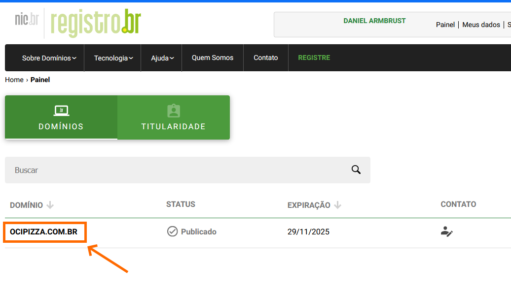
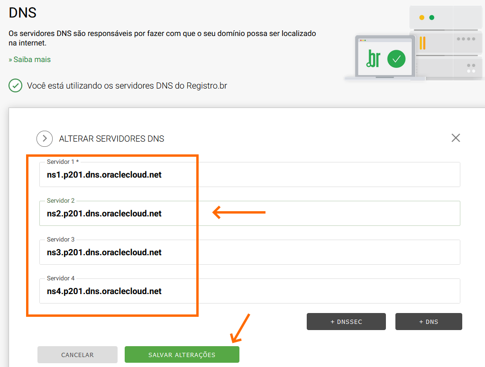

# DNS Público

## Configurando o Serviço de DNS Global

Aqui, vou explicar brevemente a teoria por trás do DNS (Domain Name System), ou Sistema de Nomes de Domínio, e também demonstrar como criar um domínio DNS no serviço de [DNS Global](https://docs.oracle.com/en-us/iaas/Content/DNS/Concepts/gettingstarted.htm) no OCI.

>_**__NOTA:__** Todos os comandos utilizados neste capítulo estão disponíveis no script [scripts/chapter-3/dns.sh](../scripts/chapter-3/dns.sh)._

## O que é DNS?

O DNS, ou Sistema de Nomes de Domínio, é um sistema fundamental da internet que traduz nomes de domínio legíveis por humanos, como **www.ocipizza.com.br**, em endereços IP numéricos, que são utilizados pelos computadores para se comunicarem entre si. Em essência, o DNS atua como uma agenda telefônica da internet, permitindo que os usuários acessem sites e serviços online de maneira mais intuitiva, sem a necessidade de memorizar sequências complexas de números. Além disso, o DNS desempenha um papel crucial na gestão de serviços de e-mail e na segurança da comunicação online.

Podemos afirmar que o DNS é um tipo de banco de dados distribuído que armazena informações sobre hosts. Esse banco de dados, que compõe o serviço DNS, é estruturado como uma árvore invertida, com uma única raiz (root) no topo. Essa hierarquia permite uma organização eficiente e escalável das informações, facilitando a resolução de nomes de domínio em endereços IP e a gestão de recursos na internet.

## Registro.BR e Domínio DNS

Podemos definir um domínio como o seu _"espaço na internet"_. Em outras palavras, é um nome que permite localizar e identificar você ou sua empresa online. O domínio representa o nome do seu site e funciona como uma identidade digital, facilitando o acesso dos usuários aos serviços que você oferece ao mundo.

No exemplo em questão, o nome do domínio utilizado é **"ocipizza.com.br"**.

Aqui no Brasil, o **registro.br** é a entidade responsável pelas atividades de registro e manutenção dos domínios com a extensão **.br**. Qualquer pessoa física ou jurídica que deseje ter seu próprio nome na internet deve, primeiramente, realizar o registro desse domínio no **registro.br**.

Para garantir que a aplicação seja facilmente acessível e esteja em conformidade com os padrões da Internet, é necessário registrar um domínio. No caso da aplicação de exemplo, o registro deve ser feito diretamente no site do "registro.br". Esse processo assegurará que a aplicação tenha um nome único e reconhecível em toda a Internet, facilitando o acesso pelos usuários.

Após a conclusão do registro e o pagamento da taxa correspondente, o domínio ficará disponível para configuração. 

## DNS Global e Zona DNS

Uma das características do DNS é ser um banco de dados de uso mais específico. Quando menciono _"mais específico"_, refiro-me ao fato de que o serviço é projetado exclusivamente para manipular informações relacionadas aos nomes dos hosts e seus endereços IP. Além disso, ao contrário de um banco de dados tradicional, onde os dados são organizados em tabelas, no DNS, as informações são estruturadas e gerenciadas dentro do que chamamos de **Zona DNS**. Essa abordagem permite uma organização hierárquica e eficiente dos registros, facilitando a resolução de nomes e a gestão de domínios e subdomínios.

Antes de começar a inserir registros no DNS, é necessário criar a Zona DNS no serviço de [DNS Global](https://docs.oracle.com/en-us/iaas/Content/DNS/Concepts/gettingstarted.htm) do OCI. É nessa zona que serão adicionados os registros relacionados aos nomes e endereços IP dos servidores, como, por exemplo, os da aplicação OCI Pizza. 

Para criar a Zona através do [OCI CLI](https://docs.oracle.com/en-us/iaas/tools/oci-cli/3.50.2/oci_cli_docs/cmdref/dns/zone/create.html), execute o comando abaixo:

```
$ oci dns zone create \
> --compartment-id "ocid1.compartment.oc1..aaaaaaaaaaaaaaaabbbbbbbbccc" \
> --name "ocipizza.com.br" \
> --zone-type "PRIMARY" \
> --scope "GLOBAL" \
> --wait-for-state "ACTIVE"
```

## Configurações no Registro.BR

Para concluir, é necessário informar ao Registro.BR que, a partir deste momento, os servidores DNS responsáveis pelo domínio "ocipizza.com.br" estão localizados no OCI.

Como você pode notar, ao criar a Zona DNS, o OCI forneceu um conjunto de servidores DNS que serão responsáveis pela resolução de nomes associados ao domínio. 

Para obter o conjunto de servidores DNS do OCI responsáveis pela resolução de nomes do domínio "ocipizza.com.br", utilize o comando abaixo:

```
$ oci dns zone get \
> --compartment-id "ocid1.compartment.oc1..aaaaaaaaaaaaaaaabbbbbbbbccc" \
> --zone-name-or-id "ocipizza.com.br" \
> --scope "GLOBAL" | grep "hostname" | tr -d '"' | awk '{print $2}'

ns1.p201.dns.oraclecloud.net.
ns2.p201.dns.oraclecloud.net.
ns3.p201.dns.oraclecloud.net.
ns4.p201.dns.oraclecloud.net.
```



