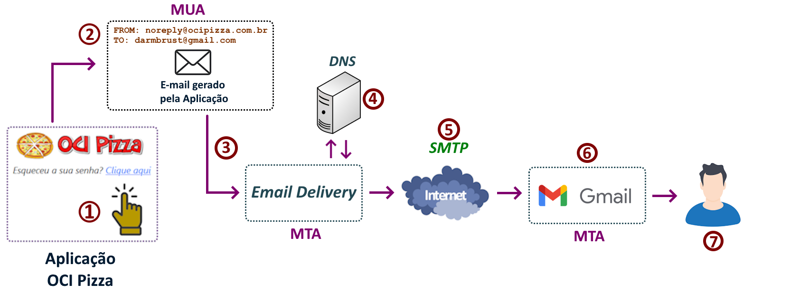
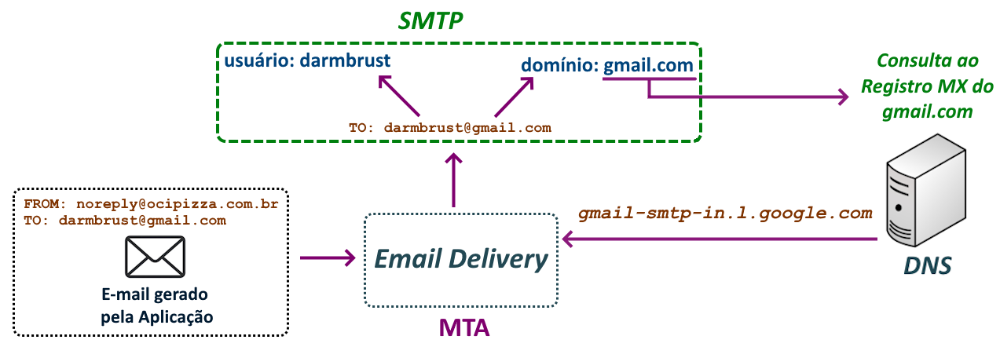

# Email Delivery

[Email Delivery](https://docs.oracle.com/en-us/iaas/Content/Email/Concepts/overview.htm) é um serviço gerenciado de [SMTP (Simple Mail Transfer Protocol)](https://datatracker.ietf.org/doc/html/rfc5321) oferecido pelo OCI para o envio de e-mails. Qualquer aplicação que necessite enviar e-mails é um candidato ideal para utilizar esse serviço, pois ele atua como um _"servidor de e-mail de saída" (outbound email server)_. 

No caso da aplicação OCI Pizza, a funcionalidade _"Esqueci minha senha"_ utilizará o Email Delivery para enviar um e-mail ao usuário, permitindo que ele redefina sua senha.

>_**__NOTA:__** De acordo com a documentação, o serviço é otimizado para o envio de e-mails em massa, marketing e transacionais, abrangendo comunicações essenciais que incluem alertas de detecção de fraude, verificações de identidade e redefinições de senha. Ele não é destinado ao envio de correspondência pessoal._

Neste capítulo, serão abordados conceitos fundamentais relacionados à entrega de e-mails na Internet, incluindo o Email Delivery. Além disso, o serviço será configurado para que a aplicação OCI Pizza possa utilizá-lo de forma eficaz.

## Email e a Internet

O tema _"E-mail e Internet"_ é complexo e abrange uma variedade de especificações e protocolos que definem a estrutura das mensagens de e-mail e o processo de transferência delas do remetente ao destinatário.

Os componentes que desempenham um papel fundamental no processo de escrita, leitura e envio de e-mails incluem:

- **Mail User Agent (MUA)**
    - Este é o software utilizado para compor e ler e-mails. Esses programas geralmente implementam os protocolos POP3 e IMAP para acessar e gerenciar os e-mails na caixa de entrada do usuário (mailbox).
    - Exemplos de MUAs incluem: [Mozilla Thunderbird](https://en.wikipedia.org/wiki/Mozilla_Thunderbird), [Microsoft Outlook](https://en.wikipedia.org/wiki/Microsoft_Outlook) e [Google Gmail](https://en.wikipedia.org/wiki/Gmail).

- **Mail Transfer Agent (MTA)**
    - Após receber a mensagem do MUA, o MTA é responsável por encaminhar e entregar o e-mail ao MTA de destino, utilizando o protocolo SMTP para realizar essa tarefa.
    - Exemplos de MTAs incluem: [OCI Email Delivery](https://docs.oracle.com/en-us/iaas/Content/Email/Concepts/overview.htm), [Postfix](https://en.wikipedia.org/wiki/Postfix_(software)) e [Sendmail](https://en.wikipedia.org/wiki/Sendmail).

SMTP é o protocolo utilizado para o envio de e-mails entre MTAs (Mail Transfer Agents). Em outras palavras, o MTA utiliza o protocolo SMTP para receber um e-mail de uma aplicação, sendo responsável por encaminhá-lo até o MTA de destino. Todo o processo de recebimento e entrega do e-mail ao destinatário é realizado por meio desse protocolo.

No contexto da aplicação OCI Pizza, quando o usuário solicita a recuperação de sua senha por meio da funcionalidade _"Esqueci minha senha"_, a aplicação processa a solicitação, gera o e-mail de recuperação e o encaminha ao serviço do Email Delivery. Nesse cenário, a aplicação OCI Pizza atua como o componente MUA (Mail User Agent), enquanto o Email Delivery funciona como o componente MTA (Mail Transfer Agent).

Para facilitar a compreensão desse fluxo, irei utilizar a ilustração abaixo, na qual um usuário da aplicação solicita a criação de uma nova senha por meio do link _"Esqueci minha senha"_:



1. O usuário clica no link _"Esqueci minha senha"_ e fornece o seu e-mail de cadastro.

2. A aplicação OCI Pizza verifica se o e-mail informado existe e, em caso afirmativo, cria um e-mail contendo as instruções para a recuperação da senha.

3. Após a criação do e-mail, a aplicação o envia ao Email Delivery para que a entrega seja realizada.

4. Se o [Email Delivery](https://docs.oracle.com/en-us/iaas/Content/Email/Concepts/overview.htm) aceitar o envio do e-mail, ele consulta o DNS para identificar o endereço IP do MTA que receberá o e-mail.

5. O protocolo SMTP, utilizado pelo [Email Delivery](https://docs.oracle.com/en-us/iaas/Content/Email/Concepts/overview.htm), é responsável por enviar o e-mail pela Internet até o MTA de destino (servidor SMTP do Gmail).

6. Ao receber o e-mail, o MTA de destino entrega a mensagem na caixa de entrada do usuário (mailbox) para que ele possa visualizá-la.

7. No exemplo em questão, o e-mail pode ser lido pelo usuário através de uma aplicação web (como o Gmail), que interage com a caixa de entrada utilizando o protocolo IMAP.

>_**__NOTA:__** Tanto o protocolo POP3 quanto o IMAP são utilizados para a leitura de e-mails, mas apresentam diferenças significativas em seu funcionamento. O POP3, ao acessar a caixa de entrada do usuário, faz o download das mensagens para o computador local, removendo-as do servidor. Em contrapartida, o IMAP permite que o usuário interaja com a caixa de entrada armazenada no servidor, sem realizar o download das mensagens, o que possibilita o acesso a e-mails de diferentes dispositivos de forma sincronizada._

## DNS

O DNS possui um papel extremamente importante no roteamento de e-mails entre diferentes MTAs na Internet.

Um MTA que deseja enviar um e-mail precisa ter acesso a um servidor DNS para resolver os nomes de host da Internet. Para receber um e-mail, por sua vez, o domínio DNS deve estar configurado corretamente, permitindo que o MTA emissor localize o MTA receptor do domínio correspondente.

O Email Delivery só possui a função de enviar e-mails e não de recebê-los. Para realizar o envio, ele utiliza os servidores DNS da Oracle para localizar os servidores MTA do domínio de destino.

É importante lembrar que o Email Delivery é um serviço gerenciado dentro do modelo PaaS, o que significa que não é necessário realizar nenhuma configuração de DNS para que o serviço funcione. No entanto, compreender a teoria sobre o funcionamento do DNS em relação ao e-mail é fundamental, pois isso pode ser útil para resolver possíveis problemas que seus usuários possam enfrentar.

No caso do _item número 4_ da seção anterior, o papel do Email Delivery é realizar uma consulta DNS para obter o endereço IP do MTA do Gmail. Essa consulta é uma operação específica que busca registros do tipo [MX (Mail Exchange)](https://en.wikipedia.org/wiki/MX_record). Em outras palavras, um registro DNS do tipo MX especifica quais servidores do domínio _"gmail.com"_ são responsáveis por receber e-mails.

A partir do endereço de e-mail (darmbrust@gmail.com), o símbolo arroba (@) permite separar a parte que representa o nome do usuário (darmbrust) da parte que indica o domínio (gmail.com). Essa separação possibilita que o sistema localize os servidores de e-mail do domínio correspondente por meio de uma consulta ao registro MX (Mail Exchange) que foi cadastrado.



Uma maneira de descobrir quais servidores do domínio _"gmail.com"_ são responsáveis por receber e-mails é utilizando o utilitário de linha de comando [nslookup](https://en.wikipedia.org/wiki/Nslookup). Através do parâmetro _-type=mx_, é possível obter a lista de servidores responsáveis pelo recebimento dos e-mails:

```
$ nslookup -type=mx gmail.com
Server:         10.255.255.254
Address:        10.255.255.254#53

Non-authoritative answer:
gmail.com       mail exchanger = 20 alt2.gmail-smtp-in.l.google.com.
gmail.com       mail exchanger = 30 alt3.gmail-smtp-in.l.google.com.
gmail.com       mail exchanger = 5 gmail-smtp-in.l.google.com.
gmail.com       mail exchanger = 10 alt1.gmail-smtp-in.l.google.com.
gmail.com       mail exchanger = 40 alt4.gmail-smtp-in.l.google.com.
```

É importante notar que, à frente do nome de cada servidor, há um número que indica a ordem de prioridade. Quanto menor o número, maior a prioridade. Assim, o servidor com o número _5_ será o primeiro a ser contatado para a entrega de e-mails. Se esse servidor estiver inacessível, o próximo a ser acionado será o servidor com o número _10_. Esse processo continua até o servidor com o número _40_, que é o último MTA da lista.

>_**__NOTA:__** Os números de prioridade podem variar de 0 a 65536. Por convenção, muitos administradores optam por definir valores de prioridade em múltiplos de 10, o que proporciona maior flexibilidade ao adicionar servidores temporários entre dois servidores em produção, por exemplo._

## Domínio de e-mail no Email Delivery

O primeiro passo na configuração do Email Delivery deve ser a configuração do domínio dentro do serviço. 

No contexto do Email Delivery, o domínio refere-se ao domínio DNS que você controla e que será utilizado para o envio de e-mails. Essa configuração é necessária para que o serviço saiba qual é o domínio que ele está autorizado a enviar e-mails.

>_**__NOTA:__** É importante destacar que o domínio da aplicação "ocipizza.com.br" já foi criado e configurado na seção [3.4 - DNS Público](./docs/chapter-3/dns.md). A configuração que será realizada aqui não interfere nem altera o domínio no serviço de DNS Público._

Para criar o domínio no serviço de Email Delivery na região sa-saopaulo-1, utilize o comando abaixo:

```
$ oci --region "sa-saopaulo-1" email domain create \
> --compartment-id "ocid1.compartment.oc1..aaaaaaaaaaaaaaaabbbbbbbbccc" \
> --name "ocipizza.com.br" \
> --description "OCI Pizza - Email Delivery (Sao Paulo)" \
> --wait-for-state "SUCCEEDED"
```

>_**__NOTA:__** É importante lembrar que o serviço é regional, e será necessário aplicar as mesmas configurações na região sa-vinhedo-1. Isso garantirá que, em caso de indisponibilidade da região sa-saopaulo-1, a aplicação continue a enviar e-mails a partir de sa-vinhedo-1._

## SPF e DKIM
 
[SPF (Sender Policy Framework)](https://docs.oracle.com/en-us/iaas/Content/Email/Tasks/configurespf.htm) e [DKIM (DomainKeys Identified Mail)](https://docs.oracle.com/en-us/iaas/Content/Email/Tasks/configuredkim.htm) são ambos mecanismos de autenticação de e-mail que ajudam a proteger contra fraudes e spoofing.

SPF e DKIM são, essencialmente, registros DNS que desempenham um papel crucial na melhoria da segurança e confiabilidade do e-mail, ajudando a reduzir a incidência de spam e fraudes. Atualmente, esses registros são obrigatórios e devem ser configurados no servidor DNS responsável pelo domínio que envia e recebe e-mails. A falta de SPF e DKIM pode resultar em diversos impactos negativos, como a deterioração da reputação do domínio e o bloqueio ou a classificação de e-mails legítimos como spam.

Após a criação do domínio no Email Delivery, é possível verificar na console web a ausência das configurações referentes ao DKIM e SPF.


Iniciaremos pelas configurações do SPF e, em seguida, abordaremos as do DKIM.

### SPF

[SPF (Sender Policy Framework)](https://docs.oracle.com/en-us/iaas/Content/Email/Tasks/configurespf.htm) é utilizado pelos servidores de e-mail receptores como um mecanismo para identificar e combater spam.

A configuração do SPF consiste em adicionar um registro DNS do tipo TXT que indica quais servidores estão autorizados a enviar e-mails em nome de um domínio. Essa informação é verificada pelo servidor receptor ao receber um e-mail. 

Os servidores autorizados a enviar e-mails em nome de um domínio são declarados em um registro DNS do tipo TXT, utilizando uma sintaxe específica. Para a aplicação OCI Pizza, esse registro será adicionado ao DNS Público associado ao domínio _"ocipizza.com.br"_. Dessa forma, quando um servidor receber um e-mail desse domínio, ele consultará o DNS responsável por _"ocipizza.com.br"_ para verificar se o servidor que enviou a mensagem possui autorização para fazê-lo.

Por ser um serviço gerenciado, a Oracle disponibiliza na [documentação](https://docs.oracle.com/en-us/iaas/Content/Email/Tasks/configurespf.htm#top) do Email Delivery o valor do SPF que será inserido no DNS da aplicação.


Para a aplicação OCI Pizza, localizada na região das Américas, o registro TXT correspondente ao SPF pode ser adicionado ao DNS utilizando o comando abaixo:

```
$ oci --region "sa-saopaulo-1" dns record domain patch \
> --compartment-id "ocid1.compartment.oc1..aaaaaaaaaaaaaaaabbbbbbbbccc" \
> --zone-name-or-id "ocipizza.com.br" \
> --domain "ocipizza.com.br" \
> --scope "GLOBAL" \
> --items "[{\"domain\": \"ocipizza.com.br\", \"rdata\": \"v=spf1 include:rp.oracleemaildelivery.com ~all\", \"rtype\": \"TXT\", \"ttl\": 3600}]"
```

Para verificar se o valor foi inserido corretamente, é possível realizar uma consulta utilizando o utilitário [nslookup](https://en.wikipedia.org/wiki/Nslookup):

```
$ nslookup -type=txt ocipizza.com.br
Server:         10.255.255.254
Address:        10.255.255.254#53

Non-authoritative answer:
ocipizza.com.br text = "v=spf1" "include:rp.oracleemaildelivery.com" "~all"
```

### DKIM
