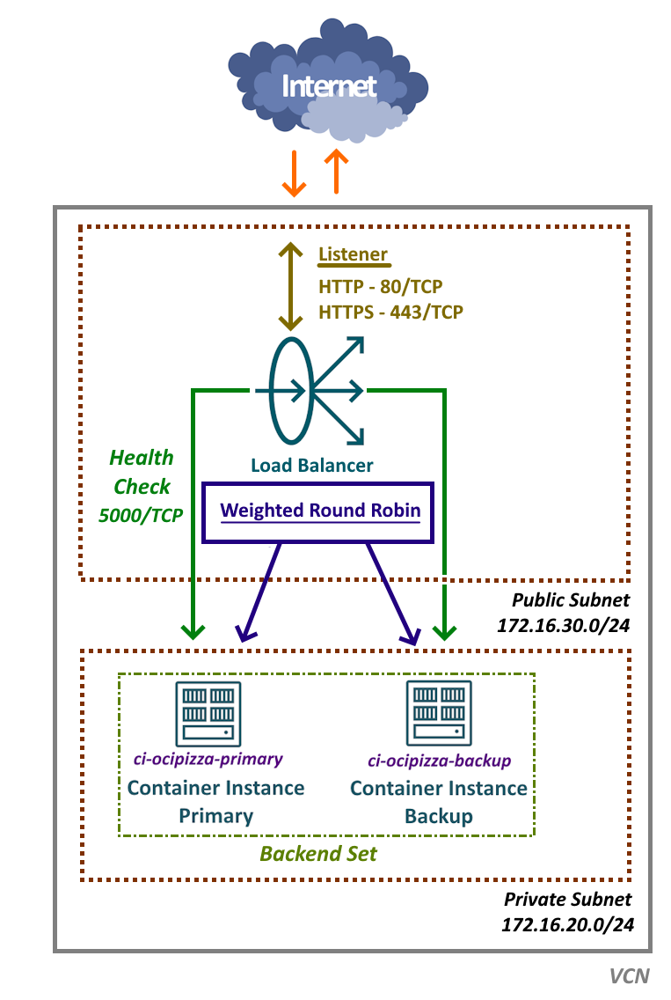

# Load Balancer

[Load Balancer](https://docs.oracle.com/en-us/iaas/Content/Balance/home.htm), também conhecido como Balanceador de Carga ou LBaaS, é um serviço disponível no OCI que desempenha um papel crucial na distribuição do tráfego de rede entre múltiplos servidores de aplicação _"saudáveis"_. Essa funcionalidade é essencial para garantir que as aplicações permaneçam disponíveis e operem de maneira eficiente, otimizando o desempenho e a resiliência do sistema.

De um modo geral, sua principal função é direcionar o tráfego de rede de um ponto de entrada para vários servidores de aplicação. Isso não apenas otimiza a utilização dos recursos, mas também possibilita o escalonamento da aplicação. Ao utilizar multiplos servidores, o Load Balancer promove a alta disponibilidade e elimina o risco de um ponto único de falha. Sua aplicação então, torna-se tolerante a falhas.

De maneira geral, a principal função do Load Balancer é direcionar o tráfego de rede de um ponto de entrada para um ou mais servidores de aplicação. Essa abordagem não apenas otimiza a utilização dos recursos, mas também permite o escalonamento eficiente da aplicação. Ao empregar múltiplos servidores, o Load Balancer garante alta disponibilidade e elimina o risco de um ponto único de falha, tornando a aplicação mais resiliente e tolerante a falhas.

>_**__NOTA:__** A expressão "escalonamento eficiente da aplicação" refere-se à capacidade de ajustar os recursos alocados a uma aplicação, aumentando ou diminuindo conforme necessário, para atender à demanda dinâmica de acessos. Essa abordagem visa otimizar o uso de recursos, evitando desperdícios e garantindo que o desempenho da aplicação não seja comprometido._

No OCI, estão disponíveis dois tipos de balanceadores:

- **[Load Balancer ou Application Load Balancer (ALB)](https://docs.oracle.com/en-us/iaas/Content/Balance/home.htm)**
    - Este é um balanceador de carga que opera na [Camada 7](https://www.geeksforgeeks.org/application-layer-in-osi-model/) do modelo OSI para os protocolos [HTTP](https://en.wikipedia.org/wiki/HTTP), [HTTPS](https://en.wikipedia.org/wiki/HTTPS), [HTTP/2](https://en.wikipedia.org/wiki/HTTP/2) e [gRPC](https://en.wikipedia.org/wiki/GRPC).

- **[Network Load Balancer (NLB)](https://docs.oracle.com/en-us/iaas/Content/NetworkLoadBalancer/home.htm)**
    - Este é um balanceador de carga que opera na [Camada 4](https://www.geeksforgeeks.org/transport-layer-in-osi-model/) do modelo OSI para os protocolos [TCP](https://en.wikipedia.org/wiki/Transmission_Control_Protocol) e [UDP](https://en.wikipedia.org/wiki/User_Datagram_Protocol).

Como o Load Balancer é um recurso de rede, neste capítulo, apresentaremos os conceitos fundamentais relacionados a esse serviço e o prepararemos para a inclusão dos servidores da aplicação OCI Pizza. A adição dos servidores de aplicação será realizada no Capítulo 4, onde será possível testar e acessar a aplicação diretamente pela Internet.

Para a aplicação OCI Pizza, que é uma aplicação web, utilizaremos um Load Balancer de Camada 7.

## Visão geral do Load Balancer

Antes de avançar com a criação do Load Balancer que será utilizado pela aplicação, é importante compreender alguns dos seus conceitos.

- **Load Balancer Público ou Privado**
    - Um [Load Balancer Público](https://docs.oracle.com/en-us/iaas/Content/Balance/Concepts/load_balancer_types.htm#LoadBalancerTypes__public-lb) é configurado em uma sub-rede pública e possui um endereço IP público, o que o torna acessível diretamente pela Internet. 
   - Por outro lado, um [Load Balancer Privado](https://docs.oracle.com/en-us/iaas/Content/Balance/Concepts/load_balancer_types.htm#LoadBalancerTypes__PrivateLoadBalancers) é configurado em uma sub-rede privada, com o objetivo de não receber requisições da Internet, operando exclusivamente com recursos internos.

- **Listener**
    - Um [Listener](https://docs.oracle.com/en-us/iaas/Content/Balance/Tasks/managinglisteners.htm#ListenerManagement) é a porta TCP através da qual o Load Balancer recebe requisições de rede.
    - Para o Network Load Balancer, é possível utilizar tanto uma porta TCP quanto uma porta UDP.
    - Em um balanceador, é possível configurar múltiplos Listeners em diferentes portas.

- **Backend Set e Backend Servers**
    - Um [Backend Set](https://docs.oracle.com/en-us/iaas/Content/Balance/Tasks/managingbackendsets.htm) é um grupo de [Backend Servers](https://docs.oracle.com/en-us/iaas/Content/Balance/Tasks/managingbackendservers.htm).
    - Os Backend Servers são os servidores de aplicação agrupados em um Backend Set, que compartilham um conjunto comum de configurações, incluindo [políticas de balanceamento](https://docs.oracle.com/en-us/iaas/Content/Balance/Reference/lbpolicies.htm) e verificações de [health check](https://docs.oracle.com/en-us/iaas/Content/Balance/Tasks/load_balancer_health_management.htm).

- **Health Check**
    - [Health Check](https://docs.oracle.com/en-us/iaas/Content/Balance/Tasks/load_balancer_health_management.htm) ou monitoramento, é um teste realizado pelo Load Balancer para verificar a disponibilidade e o funcionamento adequado de um servidor de aplicação.
    - Se o teste de Health Check falhar para um servidor de aplicação, o Load Balancer interrompe temporariamente o envio de tráfego para esse servidor. O monitoramento continua, e, caso o servidor retorne ao estado saudável (healthy), ele volta a receber tráfego de rede.
    - Os testes podem ser configurados em nível TCP, que apenas confirma se o servidor está acessível na rede (por meio da abertura de um socket), ou através de HTTP, utilizando uma URI específica. O teste HTTP não só verifica a acessibilidade do servidor, mas também assegura que a aplicação esteja funcionando corretamente.

- **Política de Balanceamento**
    - A Política de Balanceamento determina a forma como o tráfego de entrada é distribuído entre os Backend Sets, que agrupam os servidores de aplicação.
    - Atualmente, existem três diferentes Políticas de Balanceamento que podem ser utilizadas no Load Balancer de Camada 7:    

        1. [Weighted Round Robin (Revezamento)](https://docs.oracle.com/en-us/iaas/Content/Balance/Reference/lbpolicies.htm#Policies__RoundRobin)
            - É um algoritmo de balanceamento simples que distribui o tráfego de maneira sequencial entre os servidores de aplicação presentes no Backend Set.
            - Esta é uma política que funciona melhor quando todos os servidores de aplicação do Backend Set possuem capacidade computacional igual.

        2. [IP hash](https://docs.oracle.com/en-us/iaas/Content/Balance/Reference/lbpolicies.htm#Policies__IPHash)
            - Essa política calcula um hash com base no IP de origem de uma solicitação recebida, visando direcionar o tráfego para o mesmo servidor de aplicação. Isso assegura que as solicitações de um cliente específico sejam sempre encaminhadas para o mesmo servidor no Backend Set.

        3. [Least connections (Menos conexões)](https://docs.oracle.com/en-us/iaas/Content/Balance/Reference/lbpolicies.htm#Policies__LeastConnections)
            - Essa política direciona o tráfego para o servidor de aplicação no Backend Set que possui o menor número de conexões ativas.

- **HTTPS e certificados SSL**
    - O Load Balancer permite tratar conexões seguras através da configuração de um Listener que utiliza o protocolo HTTPS. Isso requer a utilização de um certificado digital.
    - Existem diferentes abordagens para gerenciar conexões criptografadas via SSL no Load Balancer, incluindo:

        1. [Terminação SSL no Load Balancer](https://docs.oracle.com/en-us/iaas/Content/Balance/Tasks/managingcertificates.htm#configuringSSLhandling__TerminatnigLoadBalancer)
            - Este é o método mais comum, no qual o tráfego é criptografado até o Listener do Load Balancer, enquanto a comunicação com o Backend Set não é criptografada.

        2. [SSL Backend](https://docs.oracle.com/en-us/iaas/Content/Balance/Tasks/managingcertificates.htm#configuringSSLhandling__TerminatnigLoadBalancer)
            - O tráfego entre o Load Balancer e os servidores do Backend Set é criptografado.

        3. [SSL Ponto-a-Ponto](https://docs.oracle.com/en-us/iaas/Content/Balance/Tasks/managingcertificates.htm#configuringSSLhandling__ImplementEndtoEndSSL)
            - O Load Balancer aceita tráfego criptografado e também criptografa o tráfego que é enviado para o backend.

- **Shape**
    - O Shape determina a capacidade total máxima pré-provisionada do Load Balancer, especificando a largura de banda disponível para o tráfego de entrada e saída. Essa configuração estabelece limites de largura de banda que começam em 10 Mbps e podem chegar até 8000 Mbps.

## Load Balancer da aplicação OCI Pizza

A arquitetura do Load Balancer utilizado pela aplicação OCI Pizza é ilustrada no desenho abaixo:



O Load Balancer terá um _Listener HTTP_ na porta 80/TCP e outro _HTTPS_ na porta 443/TCP. A política de balanceamento selecionada será a _Weighted Round Robin_, e o monitoramento _Health Check_ será realizado na porta _5000/TCP_. 

>_**__NOTA:__** Neste momento, serão criados apenas os Load Balancers nas respectivas regiões. As configurações serão concluídas posteriormente no capítulo [4.2 - Container Instances](./docs/chapter-4.md/container-instances.md), onde criaremos os Container Instances que servirão como backends para os Load Balancers._

## Criando o Load Balancer

É necessário configurar dois Load Balancers sendo na região de _São Paulo (sa-saopaulo-1)_ e outro na região de _Vinhedo (sa-vinhedo-1)_. Para evitar redundâncias, será apresentado apenas os comandos da região de São Paulo, uma vez que a sintaxe é a mesma para a região de Vinhedo.

>_**__NOTA:__** Todos os comandos utilizados neste capítulo estão disponíveis nos scripts [scripts/chapter-3/lb-saopaulo.sh](../scripts/chapter-3/lb-saopaulo.sh) e [scripts/chapter-3/lb-vinhedo.sh](../scripts/chapter-3/lb-vinhedo.sh)._

### Load Balancer

Antes de criar o Load Balancer, é necessário obter o OCID do Endereço IP Público que foi reservado, conforme descrito na seção _[3.3 - Reserva de Endereço IP Público](./reserved-public-ip.md)_. 

```
$ oci --region "sa-saopaulo-1" network public-ip list \
    --compartment-id "ocid1.compartment.oc1..aaaaaaaaaaaaaaaabbbbbbbbccc" \
    --lifetime "RESERVED" \
    --scope "REGION" \
    --all \
    --query 'data[?name=="pubip-lb-saopaulo"].id'
[
  "ocid1.publicip.oc1.sa-saopaulo-1.aaaaaaaaaaaaaaaabbbbbbbbccc"
]
```

Também é necessário obter o OCID da sub-rede pública onde o Load Balancer será criado:

```
$ oci --region "sa-saopaulo-1" network subnet list \
    --compartment-id "ocid1.compartment.oc1..aaaaaaaaaaaaaaaabbbbbbbbccc" \
    --display-name "subnpub" \
    --lifecycle-state "AVAILABLE" \
    --query 'data[].id'
[
  "ocid1.subnet.oc1.sa-saopaulo-1.aaaaaaaaaaaaaaaabbbbbbbbccc"
]
```

Com essas informações, será criado um Load Balancer com uma largura de banda máxima de 10 Mbps:

```
$ oci lb load-balancer create \
    --compartment-id "ocid1.compartment.oc1..aaaaaaaaaaaaaaaabbbbbbbbccc" \
    --display-name "lb-saopaulo" \
    --shape-name "flexible" \
    --shape-details "{\"minimumBandwidthInMbps\": 10, \"maximumBandwidthInMbps\": 10}" \
    --subnet-ids "[\"ocid1.subnet.oc1.sa-saopaulo-1.aaaaaaaaaaaaaaaabbbbbbbbccc\"]" \
    --is-private "false" \
    --reserved-ips "[{\"id\": \"ocid1.publicip.oc1.sa-saopaulo-1.aaaaaaaaaaaaaaaabbbbbbbbccc\"}]" \
    --wait-for-state "SUCCEEDED"
```

Para obter o OCID do Load Balancer, utilize o comando abaixo:

```
$  oci --region "sa-saopaulo-1" lb load-balancer list \
> --compartment-id "ocid1.compartment.oc1..aaaaaaaaaaaaaaaabbbbbbbbccc \
> --all \
> --display-name "lb-saopaulo" \
> --lifecycle-state "ACTIVE" \
> --query 'data[].id'
[
  "ocid1.loadbalancer.oc1.sa-saopaulo-1.aaaaaaaaaaaaaaaabbbbbbbbccc"
]
```

### Backend Set

Um Backend Set é uma configuração que define um grupo de servidores disponíveis para processar solicitações e que receberão o tráfego de rede proveniente do Load Balancer. Além disso, é no Backend Set que são estabelecidas as configurações de Health Check, que monitoram todos os servidores integrantes do grupo.

Para a aplicação OCI Pizza, será criado um Backend Set que, posteriormente, no Capítulo 4, receberá os servidores de aplicação. O Health Check será configurado para monitorar esses servidores na porta 5000/TCP.

```
$ oci --region "sa-saopaulo-1" lb backend-set create \
> --load-balancer-id "ocid1.loadbalancer.oc1.sa-saopaulo-1.aaaaaaaaaaaaaaaabbbbbbbbccc" \
> --name "backendset-1" \
> --policy "ROUND_ROBIN" \
> --health-checker-protocol "TCP" \
> --health-checker-port "5000" \
> --wait-for-state "SUCCEEDED"
```

### Rule Sets

[Rule Sets](https://docs.oracle.com/en-us/iaas/Content/Balance/Tasks/managingrulesets.htm) são regras definidas pelo administrador do Load Balancer para tomar alguma ação sobre o tráfego que entra no Load Balancer, mais especificamenete, no tráfego que entra no Listener do Load Balancer.

O ponto de entrada de tráfego do Load Balancer é o Listener. O tráfego de rede que chega ao Listener é analisado pelas Rule Sets, se houver, para então tomar alguma ação.

Neste contexto, para a aplicação OCI Pizza, será criada uma Rule Set que redireciona automaticamente todo o tráfego de rede que chega ao Listener HTTP na porta 80/TCP para o Listener HTTPS na porta 443/TCP. Essa é uma boa prática, pois garante que apenas tráfego criptografado seja permitido para a aplicação.

```
$ oci --region "sa-saopaulo-1" lb rule-set create \
> --load-balancer-id "ocid1.loadbalancer.oc1.sa-saopaulo-1.aaaaaaaaaaaaaaaabbbbbbbbccc" \
> --name "http_redirect_https" \
> --items '[{
>     "action": "REDIRECT", 
>     "conditions": [{
>          "attributeName": "PATH", 
>          "attributeValue": "/", 
>          "operator": "FORCE_LONGEST_PREFIX_MATCH"
>     }], 
>     "redirectUri": {
>        "host": "{host}", 
>        "path": "{path}", 
>        "port": 443, 
>        "protocol": "HTTPS", 
>        "query": "{query}"
>     }, 
>     "responseCode": 301
> }]' \
> --wait-for-state "SUCCEEDED"
```

### HTTP Listener

O primeiro Listener a ser criado será o responsável por receber tráfego de rede pelo protocolo HTTP na porta 80/TCP. É nesse Listener que será especificado o Rule Set para redirecionar o tráfego para o Listener HTTPS.

```
$ oci --region "sa-saopaulo-1" lb listener create \
> --default-backend-set-name "backendset-1" \
> --load-balancer-id "ocid1.loadbalancer.oc1.sa-saopaulo-1.aaaaaaaaaaaaaaaabbbbbbbbccc" \
> --name "listener-http" \
> --rule-set-names "[\"http_redirect_https\"]" \
> --port 80 \
> --protocol "HTTP" \
> --wait-for-state "SUCCEEDED"
```

Observe também que, no comando acima, foi necessário especificar o nome do Backend Set. Isso significa que, após o tráfego de rede passar pelo Listener, ele será direcionado para os servidores de aplicação daquele Backend Set que foi indicado.

>_**__NOTA:__** É possível configurar múltiplos Backend Sets em um Listener utilizando [Virtual Hostnames](https://docs.oracle.com/en-us/iaas/Content/Balance/Tasks/hostname_management.htm). Este assunto será abordado em detalhes no Capítulo X._

### HTTPS Listener

O segundo Listener será responsável por receber tráfego de rede pelo protocolo HTTPS na porta 443/TCP. Neste caso, é necessário especificar o OCID do certificado digital que foi configurado na seção _[3.5 - Let's Encrypt e o Serviço de Certificados do OCI](./lets-encrypt.md)_.

```
$ oci --region "sa-saopaulo-1" lb listener create \
> --default-backend-set-name "backendset-1" \
> --load-balancer-id "ocid1.loadbalancer.oc1.sa-saopaulo-1.aaaaaaaaaaaaaaaabbbbbbbbccc" \
> --name "listener-https" \
> --port 443 \
> --protocol "HTTP" \
> --ssl-certificate-ids "[\"ocid1.certificate.oc1.sa-saopaulo-1.aaaaaaaaaaaaaaaabbbbbbbbccc\"]" \
> --wait-for-state "SUCCEEDED"
```

>_**__NOTA:__** Observe que o valor do parâmetro --protocol é HTTP e não HTTPS._

## Conclusão

Aqui foram apresentados os comandos para criar um Load Balancer capaz de gerenciar tráfego HTTP e HTTPS. Os servidores da aplicação OCI Pizza, que na verdade são contêineres de aplicação, serão adicionados ao Backend Set no Capítulo 4. O Backend Set poderá ser populado apenas após a obtenção dos endereços IP dos contêineres de aplicação.