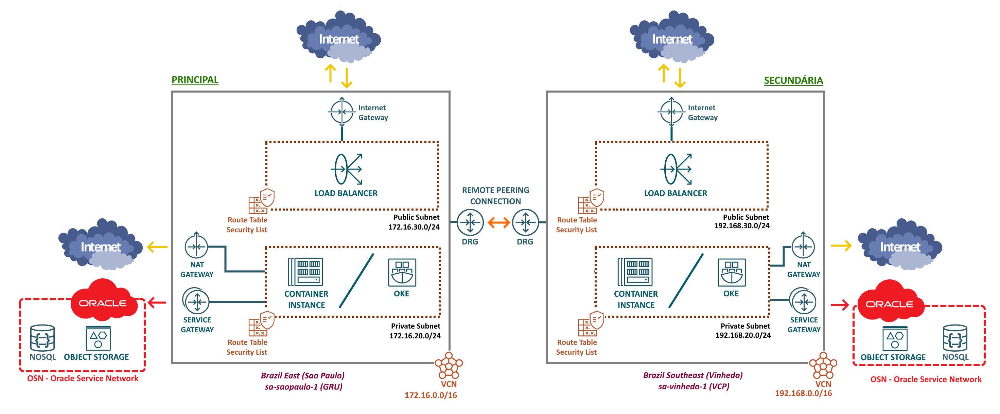

# O Serviço de Redes do OCI

O [Serviço de Redes](https://docs.oracle.com/en-us/iaas/Content/Network/Concepts/landing.htm) do OCI disponibiliza versões virtuais para a maioria dos componentes de redes tradicionais que conhecemos. A configuração da rede é um pré-requisito essencial para o funcionamento de qualquer aplicação na nuvem.

>_**__NOTA:__** Todos os comandos utilizados neste capítulo estão disponíveis nos scripts [scripts/chapter-3/network-saopaulo.sh](../scripts/chapter-3/network-saopaulo.sh) e [scripts/chapter-3/network-vinhedo.sh](../scripts/chapter-3/network-vinhedo.sh)._

A topologia da rede utilizada para a aplicação OCI Pizza pode ser visualizada no desenho abaixo:



## Descrição dos Componentes da Rede

Abaixo, apresentamos a descrição dos componentes de rede que serão utilizados pela aplicação OCI Pizza.

- **[VCN (Virtual Cloud Network)](https://docs.oracle.com/en-us/iaas/Content/Network/Tasks/VCNs.htm)**
  - Trata-se de uma rede virtual privada criada dentro de uma região.
  - Após a criação e configuração da VCN, é possível criar sub-redes, máquinas virtuais, bancos de dados e outros recursos.

- **Subnet**
  - É a divisão de uma VCN em partes menores, conhecidas como sub-redes.
  - Cada sub-rede consiste em um intervalo contíguo de endereços IP que não se sobrepõe aos intervalos de outras sub-redes da VCN.
  - Uma sub-rede pode ser _pública_ ou _privada_. Uma sub-rede pública permite expor um recurso à internet por meio de um IP público, enquanto uma sub-rede privada acessa a internet apenas por meio da técnica de NAT (Network Address Translation).
  - Ao criar uma sub-rede, três endereços IP são automaticamente reservados. Esses endereços são: 
    - Endereço de rede
    - Endereço de Broadcast 
    - Endereço do Default Gateway (roteador da sub-rede)

- **[Route Table](https://docs.oracle.com/en-us/iaas/Content/Network/Tasks/managingroutetables.htm)**
  - Contém as regras de roteamento para direcionar o tráfego de rede ao próximo salto (next-hop).
  - Sub-redes dentro da mesma VCN podem se comunicar sem a necessidade de regras de roteamento. No entanto, é possível definir esse tipo de regra, caso desejado.

- **[Security List](https://docs.oracle.com/en-us/iaas/Content/Network/Concepts/securitylists.htm)**
  - É o firewall virtual que protege a sub-rede.
  - Todo o tráfego que entra e sai da sub-rede é verificado pela sua Security List.
  - Por padrão, toda a comunicação é bloqueada pela Security List. No entanto, é possível permitir o tráfego de rede com base em protocolos e portas, tanto para IPv4 quanto para IPv6.

- **[VNIC (Virtual Network Interface Card)](https://docs.oracle.com/en-us/iaas/Content/Network/Tasks/managingVNICs.htm)**
  - O termo vem de NIC (network interface card). É uma interface de rede virtual.
  - Toda VNIC obrigatóriamente reside em uma sub-rede.
  - Uma VNIC pode ter até 31 endereços IPv4 privados, um endereço IPv4 público opcional para cada IP privado e até 32 endereços IPv6 opcionais.

- **[DHCP Options](https://docs.oracle.com/en-us/iaas/Content/Network/Tasks/managingDHCP.htm)**
  - É o serviço DHCP da sub-rede.

- **Gateways de Comunicação**

  - [Internet Gateway (IGW)](https://docs.oracle.com/en-us/iaas/Content/Network/Tasks/managingIGs.htm#Internet_Gateway)
    - Permite a comunicação direta proveniente da internet. Para isso, é necessário que o recurso possua um IP público. 

  - [NAT Gateway (NGW)](https://docs.oracle.com/en-us/iaas/Content/Network/Tasks/NATgateway.htm)
    - Permite que recursos sem um endereço IP público acessem a internet, possibilitando a comunicação enquanto evita a exposição direta desses recursos na rede pública.

  - [Service Gateway (SGW)](https://docs.oracle.com/en-us/iaas/Content/Network/Tasks/servicegateway.htm#overview)
    - Permite que recursos de uma sub-rede se comuniquem diretamente com os serviços do OCI por meio da [Oracle Services Network (OSN)](https://docs.oracle.com/en-us/iaas/Content/Network/Tasks/servicegateway.htm#oracle-services), sem a necessidade de utilizar a internet.

  - [Dynamic Routing Gateway (DRG)](https://docs.oracle.com/en-us/iaas/Content/Network/Tasks/managingDRGs.htm)
    - É um roteador virtual.
    - Permite conectividade entre as suas VCNs, tanto dentro de uma mesma região quanto entre regiões diferentes, além de permitir a conexão com o ambiente on-premises por meio de [VPN](https://docs.oracle.com/en-us/iaas/Content/Network/Tasks/managingIPsec.htm) ou [FastConnect](https://docs.oracle.com/en-us/iaas/Content/Network/Concepts/fastconnect.htm).

A seguir, será criada toda a rede da região _Brazil East (São Paulo)_. Para a rede da região _Brazil Southeast (Vinhedo)_, os comandos permanecem os mesmos, com a modificação apenas de alguns valores correspondentes à região, como endereços IP e nomes dos recursos. Por essa razão, não serão apresentados aqui. 

## VCN (vcn-saopaulo)

Iniciaremos com a criação da VCN:

- **Sao Paulo, Brazil (sa-saopaulo-1):**
  - Nome: vcn-saopaulo
  - Bloco CIDR: 172.16.0.0/16

```
$ oci --region "sa-saopaulo-1" network vcn create \
> --compartment-id "ocid1.compartment.oc1..aaaaaaaaaaaaaaaabbbbbbbbccc" \
> --cidr-blocks '["172.16.0.0/16"]' \
> --display-name "vcn-saopaulo" \
> --dns-label "vcnsaopaulo" \
> --wait-for-state AVAILABLE
```

O comando abaixo retorna o OCID da VCN "vcn-saopaulo" que foi criada, pois os recursos subsequentes necessitam dessa informação:

```
$ oci --region "sa-saopaulo-1" network vcn list \
> --compartment-id "ocid1.compartment.oc1..aaaaaaaaaaaaaaaabbbbbbbbccc" \
> --all \
> --display-name "vcn-saopaulo" \
> --query 'data[].id'
[
  "ocid1.vcn.oc1.sa-saopaulo-1.aaaaaaaaaaaaaaaabbbbbbbbccc"
]
```

## Gateways de Comunicação

Os **Gateways de Comunicação** permitem que os recursos dentro de uma sub-rede no OCI se comuniquem com qualquer outro recurso externo. Esses recursos externos podem incluir a Internet, a rede de serviços da Oracle [(Oracle Services Network (OSN)](https://docs.oracle.com/en-us/iaas/Content/Network/Tasks/servicegateway.htm#oracle-services) ou ambientes on-premises.

Todo gateway de comunicação que for criado, com exceção do DRG, requer uma VCN que já tenha sido previamente criada. Essa dependência pode ser observada por meio do parâmetro _--vcn-id_ nos comandos a seguir.

### Internet Gateway (igw)

```
$ oci --region "sa-saopaulo-1" network internet-gateway create \
> --compartment-id "ocid1.compartment.oc1..aaaaaaaaaaaaaaaabbbbbbbbccc" \
> --is-enabled "true" \
> --vcn-id "ocid1.vcn.oc1.sa-saopaulo-1.aaaaaaaaaaaaaaaabbbbbbbbccc" \
> --display-name "igw" \
> --wait-for-state "AVAILABLE"
```

```
$ oci --region "sa-saopaulo-1" network internet-gateway list \
> --compartment-id "ocid1.compartment.oc1..aaaaaaaaaaaaaaaabbbbbbbbccc" \
> --all \
> --display-name "igw" \
> --vcn-id "ocid1.vcn.oc1.sa-saopaulo-1.aaaaaaaaaaaaaaaabbbbbbbbccc" \
> --lifecycle-state "AVAILABLE" \
> --query 'data[].id'
[
  "ocid1.internetgateway.oc1.sa-saopaulo-1.aaaaaaaaaaaaaaaabbbbbbbbccc"
]
```

### NAT Gateway (ngw)

```
$ oci --region "sa-saopaulo-1" network nat-gateway create \
> --compartment-id "ocid1.compartment.oc1..aaaaaaaaaaaaaaaabbbbbbbbccc" \
> --vcn-id "ocid1.vcn.oc1.sa-saopaulo-1.aaaaaaaaaaaaaaaabbbbbbbbccc" \
> --block-traffic "false" \
> --display-name "ngw" \
> --wait-for-state "AVAILABLE"
```

```
$ oci --region "sa-saopaulo-1" network nat-gateway list \
> --compartment-id "ocid1.compartment.oc1..aaaaaaaaaaaaaaaabbbbbbbbccc" \
> --all \
> --display-name "ngw" \
> --vcn-id "ocid1.vcn.oc1.sa-saopaulo-1.aaaaaaaaaaaaaaaabbbbbbbbccc" \
> --lifecycle-state "AVAILABLE" \
> --query 'data[].id'
[
  "ocid1.natgateway.oc1.sa-saopaulo-1.aaaaaaaaaaaaaaaabbbbbbbbccc"
]
```

### Service Gateway (sgw)

A [Oracle Services Network (OSN)](https://docs.oracle.com/en-us/iaas/Content/Network/Tasks/servicegateway.htm) é uma rede conceitual dentro do OCI dedicada exclusivamente aos serviços da Oracle. Esses serviços possuem endereços IP públicos que geralmente são acessados pela internet.

A função do Service Gateway é possibilitar que seus recursos dentro da VCN acessem diretamente e de forma privada esses serviços. Além disso, o uso de um Service Gateway evita a cobrança de **Outbound Data Transfer** ao acessar esses serviços tanto a partir da VCN quanto do ambiente on-premises.

>_**__NOTA:__** O preço do Outbound Data Transfer para a sua região pode ser consultado no link: [Cloud Networking Pricing](https://www.oracle.com/cloud/networking/pricing/)_

O Service Gateway utiliza o conceito de _Service CIDR label_ que é uma string que representa os endereços públicos dos serviços Oracle em uma região. Usar uma string que representa os endereços dos serviços é mais prático do que inserir os IPs manualmente.

Para listar os _Service CIDR labels_ de uma região, utilize o comando a seguir:

```
$ oci --region "sa-saopaulo-1" network service list --all
{
  "data": [
    {
      "cidr-block": "all-gru-services-in-oracle-services-network",
      "description": "All GRU Services In Oracle Services Network",
      "id": "ocid1.service.oc1.sa-saopaulo-1.aaaaaaaaaaaaaaaabbbbbbbbccc",
      "name": "All GRU Services In Oracle Services Network"
    },
    {
      "cidr-block": "oci-gru-objectstorage",
      "description": "OCI GRU Object Storage",
      "id": "ocid1.service.oc1.sa-saopaulo-1.aaaaaaaaaaaaaaaabbbbbbbbcccddddddd",
      "name": "OCI GRU Object Storage"
    }
  ]
}
```

Foram listados dois _Service CIDR labels_ para a região "sa-saopaul-1":

- **all-gru-services-in-oracle-services-network**
  - Esse label representa todos os serviços disponíveis na região, incluindo servidores para atualização do Oracle Linux (yum update), Object Storage, entre outros.

- **oci-gru-objectstorage**
  - Esse label representa somente os IPs do serviço Object Storage.

Para criar o Service Gateway que utilizará todos os serviços _(all-gru-services-in-oracle-services-network)_, utilize o comando abaixo:

```
$ oci --region "sa-saopaulo-1" network service-gateway create \
> --compartment-id "ocid1.compartment.oc1..aaaaaaaaaaaaaaaabbbbbbbbccc" \
> --vcn-id "ocid1.vcn.oc1.sa-saopaulo-1.aaaaaaaaaaaaaaaabbbbbbbbccc" \
> --services "[
>     {
>         \"serviceId\": \"ocid1.service.oc1.sa-saopaulo-1.aaaaaaaaaaaaaaaabbbbbbbbccc\",
>         \"serviceName\": \"All GRU Services In Oracle Services Network\"
>     }
> ]" \
> --display-name "sgw" \
> --wait-for-state "AVAILABLE"
```

```
$ oci --region "sa-saopaulo-1" network service-gateway list \
> --compartment-id "ocid1.compartment.oc1..aaaaaaaaaaaaaaaabbbbbbbbccc" \
> --all \
> --vcn-id "ocid1.vcn.oc1.sa-saopaulo-1.aaaaaaaaaaaaaaaabbbbbbbbccc" \
> --lifecycle-state "AVAILABLE" \
> --query 'data[].id'
[
  "ocid1.servicegateway.oc1.sa-saopaulo-1.aaaaaaaaaaaaaaaabbbbbbbbccc"
]
```

## Route Table (rtb_subnpub e rtb_subnprv)

A VCN utiliza a [Route Table](https://docs.oracle.com/en-us/iaas/Content/Network/Tasks/managingroutetables.htm) para direcionar o tráfego de rede para fora da VCN. Uma Route Table é composta por uma ou mais _Route Rules_, que especificam qual gateway receberá um determinado tráfego de rede _(próximo salto ou next hop)_.

Em resumo, a Route Table contém um conjunto de regras que definem como os dados originados em uma sub-rede devem ser encaminhados, por meio de um gateway de comunicação, para uma rede distinta. O papel do Gateway de Comunicação pode ser visto como uma "ponte" entre essas duas redes diferentes.

 >_**__NOTA:__** A Route Table utilizada por uma subnet é diferente da Route Table utilizada pelo DRG. Aqui, será criada e configurada uma Route Table para a subnet._

### Route Table da sub-rede pública (rtb_subnpub)

A Route Table da sub-rede pública _(rtb\_subnpub)_ incluirá uma Route Rule que utilizará o [Internet Gateway (IGW)](https://docs.oracle.com/en-us/iaas/Content/Network/Tasks/managingIGs.htm#Internet_Gateway), permitindo que os recursos dessa sub-rede recebam tráfego proveniente da Internet.

```
$ oci --region "sa-saopaulo-1" network route-table create \
> --compartment-id "ocid1.compartment.oc1..aaaaaaaaaaaaaaaabbbbbbbbccc" \
> --vcn-id "ocid1.vcn.oc1.sa-saopaulo-1.aaaaaaaaaaaaaaaabbbbbbbbccc" \
> --display-name "rtb_subnpub" \
> --route-rules "[
>     {
>         \"destination\": \"0.0.0.0/0\",
>         \"destinationType\": \"CIDR_BLOCK\",
>         \"networkEntityId\": \"ocid1.internetgateway.oc1.sa-saopaulo-1.aaaaaaaaaaaaaaaabbbbbbbbccc\"
>     }
> ]" \
> --wait-for-state "AVAILABLE"
```

### Route Table da sub-rede privada (rtb_subnprv)

A Route Table da sub-rede privada _(rtb\_subnprv)_ incluirá uma Route Rule que utilizará o [NAT Gateway (NGW)](https://docs.oracle.com/en-us/iaas/Content/Network/Tasks/NATgateway.htm) para permitir que os recursos acessem a Internet sem receber tráfego direto. Além disso, haverá uma Route Rule que utilizará o [Service Gateway (SGW)](https://docs.oracle.com/en-us/iaas/Content/Network/Tasks/servicegateway.htm#overview).

```
$ oci --region "sa-saopaulo-1" network route-table create \
> --compartment-id "ocid1.compartment.oc1..aaaaaaaaaaaaaaaabbbbbbbbccc" \
> --vcn-id "ocid1.vcn.oc1.sa-saopaulo-1.aaaaaaaaaaaaaaaabbbbbbbbccc" \
> --display-name "rtb_subnprv" \
> --route-rules "[
>     {
>         \"destination\": \"0.0.0.0/0\",
>         \"destinationType\": \"CIDR_BLOCK\",
>         \"networkEntityId\": \"ocid1.internetgateway.oc1.sa-saopaulo-1.aaaaaaaaaaaaaaaabbbbbbbbccc\"
>     },
>     {
>         \"destination\": \"all-gru-services-in-oracle-services-network\",
>         \"destinationType\": \"SERVICE_CIDR_BLOCK\",
>         \"networkEntityId\": \"ocid1.servicegateway.oc1.sa-saopaulo-1.aaaaaaaaaaaaaaaabbbbbbbbccc\"
>     }
> ]" \
> --wait-for-state "AVAILABLE"
```

## Security List (seclist_subnpub e seclist_subnprv)

A [Security List](https://docs.oracle.com/en-us/iaas/Content/Network/Concepts/securitylists.htm) atua como um firewall para a sub-rede. Todo o tráfego de rede que entra (ingress) e sai (egress) da sub-rede é inspecionado pelas respectivas _Security Rules_ da Security List, com o objetivo de permitir (accept) ou bloquear (drop) o tráfego.

O comportamento padrão da Security List é bloquear todo o tráfego de rede, a menos que exista uma regra que o permita. Não é possível definir regras para bloquear o tráfego, apenas regras que autorizem a passagem do tráfego podem ser configuradas.

Uma sub-rede sempre possui uma ou mais Security Lists associadas, com um [limite máximo de cinco](https://docs.oracle.com/en-us/iaas/Content/Network/Concepts/securityrules.htm#comparison). O tráfego de rede que "entra" em uma sub-rede (ingress) é inspecionado pelas Security Lists, uma a uma, de cima para baixo, de acordo com a ordem de criação. Esse tráfego procura encontrar uma regra que permita sua passagem em alguma das Security Lists definidas; caso contrário, será bloqueado por padrão.

Para a saída do tráfego (egress), o processo é semelhante, mas agora a origem é um recurso existente na sub-rede que busca alcançar outro recurso fora dela.

Ao criar uma Security Rule, é necessário especificar a origem ou destino do tráfego _(source ou destination)_, o protocolo _(protocol)_ e se a regra é do tipo _stateful_ ou _stateless_.

>_**__NOTA:__** Se sua sub-rede apresentar um alto volume de tráfego, a Oracle recomenda o uso de regras do tipo stateless. Para compreender melhor as diferenças entre regras stateful e stateless, consulte a documentação ["Stateful Versus Stateless Rules"](https://docs.oracle.com/en-us/iaas/Content/Network/Concepts/securityrules.htm#stateful). Para a aplicação OCI Pizza serão utilizadas regras do tipo stateful, pois são mais simples de definir._

A Security List suporta diferentes protocolos, mas apenas os listados abaixo permitem a especificação de opções adicionais e são os mais comumente utilizados. De acordo com a [documentação da API](https://docs.oracle.com/en-us/iaas/api/#/en/iaas/20160918/datatypes/IngressSecurityRule) da Security List, é possível utilizar a string _"all"_ ou um dos valores a seguir ao definir uma Security Rule:

  - all (todos os protocolos)  
  - 1 (ICMP)
  - 6 (TCP)
  - 17 (UDP)
  - 58 (ICMPv6)

Para a aplicação OCI Pizza, serão criadas duas [Security Lists](https://docs.oracle.com/en-us/iaas/Content/Network/Concepts/securitylists.htm). Uma delas funcionará como o firewall da sub-rede pública _(seclist\_subnpub)_, enquanto a outra será destinada à sub-rede privada _(seclist\_subnprv)_.

>_**__NOTA:__** É uma boa prática de segurança definir as Security Rules da forma mais restritiva possível, permitindo apenas o tráfego que é realmente necessário. As Security Rules utilizadas para a aplicação OCI Pizza têm fins didáticos e servem apenas para demonstrar o processo de criação._

### Security Lists da sub-rede pública (seclist_subnpub) 

A Security List da sub-rede pública permitirá tráfego de entrada (ingress) apenas para as portas 80/TCP e 443/TCP, provenientes de qualquer origem na Internet. Em relação ao tráfego de saída (egress), não haverá restrições, permitindo a passagem de todo o tráfego para qualquer destino. 

```
$ oci --region "sa-saopaulo-1" network security-list create \
> --compartment-id "ocid1.compartment.oc1..aaaaaaaaaaaaaaaabbbbbbbbccc" \
> --vcn-id "ocid1.vcn.oc1.sa-saopaulo-1.aaaaaaaaaaaaaaaabbbbbbbbccc" \
> --display-name "seclist_subnpub" \
> --ingress-security-rules "[
>       {
>          \"source\": \"0.0.0.0/0\", 
>          \"protocol\": \"6\", 
>          \"isStateless\": false, 
>          \"tcpOptions\": {
>               \"destinationPortRange\": {
>                       \"min\": 80, \"max\": 80
>               }, 
>               \"sourcePortRange\": {
>                       \"min\": 1024, \"max\": 65535
>               }
>          }          
>       },
>       {
>          \"source\": \"0.0.0.0/0\", 
>          \"protocol\": \"6\", 
>          \"isStateless\": false,
>          \"tcpOptions\": {
>               \"destinationPortRange\": {
>                       \"min\": 443, \"max\": 443
>               }, 
>               \"sourcePortRange\": {
>                       \"min\": 1024, \"max\": 65535
>               }
>          }              
>       }
> ]" \
> --egress-security-rules "[
>       {
>          \"destination\": \"0.0.0.0/0\",
>          \"protocol\": \"all\", 
>          \"isStateless\": false
>       }
>   ]" \
>   --wait-for-state "AVAILABLE"
```

### Security Lists da sub-rede privada (seclist_subnprv) 

A Security List da sub-rede privada permite o tráfego de entrada (ingress) e saída (egress) sem restrições.

```
$ oci --region "sa-saopaulo-1" network security-list create \
> --compartment-id "ocid1.compartment.oc1..aaaaaaaaaaaaaaaabbbbbbbbccc" \
> --vcn-id "ocid1.vcn.oc1.sa-saopaulo-1.aaaaaaaaaaaaaaaabbbbbbbbccc" \
> --display-name "seclist_subnprv" \
> --ingress-security-rules "[
>       {
>           \"source\": \"0.0.0.0/0\", 
>           \"protocol\": \"all\", 
>           \"isStateless\": false             
>       }
> ]" \
> --egress-security-rules "[
>       {
>          \"destination\": \"0.0.0.0/0\",
>          \"protocol\": \"all\", 
>          \"isStateless\": false
>       }
> ]" \
> --wait-for-state "AVAILABLE"
```

## DHCP Options (dhcp-options)

O [DHCP Options](https://docs.oracle.com/en-us/iaas/Content/Network/Tasks/managingDHCP.htm) é utilizado para fornecer informações de configuração de rede aos recursos criados dentro de uma sub-rede. Ele possibilita que os recursos recebam automaticamente configuração essenciais, como o Endereço IP, Máscara de sub-rede, Gatreway Padrão e os servidores DNS a serem utilizados.

>_**__NOTA:__** Existem configurações avançadas que permitem a modificação das opções do DHCP Options, especialmente no que diz respeito às configurações de DNS. Aqui optaremos por manter as configurações padrão do DHCP Options._

Cada sub-rede deve ter um DHCP Options definido, e geralmente, um único DHCP Options é utilizado para todas as sub-redes de uma VCN.

```
$ oci --region "sa-saopaulo-1" network dhcp-options create \
> --compartment-id "ocid1.compartment.oc1..aaaaaaaaaaaaaaaabbbbbbbbccc" \
> --vcn-id "ocid1.vcn.oc1.sa-saopaulo-1.aaaaaaaaaaaaaaaabbbbbbbbccc" \
> --display-name "dhcp-options" \
> --domain-name-type "VCN_DOMAIN" \
> --options '[
>       {"type": "DomainNameServer", "serverType": "VcnLocalPlusInternet"}
> ]' \
> --wait-for-state "AVAILABLE"
```

## Subnet (subnpub e subnprv)

Por fim, a criação das sub-redes pública (subnpub) e privada (subnprv). AO objetivo é implementar um Load Balancer na sub-rede pública, que será responsável por receber o tráfego proveniente da Internet. Na sub-rede privada, por sua vez, serão alocados os recursos computacionais necessários para a execução da aplicação.

A sub-rede depende de todos os recursos que foram criados ao longo deste capítulo. Portanto, é necessário fornecer todos os respectivos OCIDs, além de um bloco CIDR único e específico para a sub-rede.

### Sub-rede Pública (subnpub)

```
$ oci --region "sa-saopaulo-1" network subnet create \
> --compartment-id "ocid1.compartment.oc1..aaaaaaaaaaaaaaaabbbbbbbbccc" \
> --vcn-id "ocid1.vcn.oc1.sa-saopaulo-1.aaaaaaaaaaaaaaaabbbbbbbbccc" \
> --route-table-id "ocid1.routetable.oc1.sa-saopaulo-1.aaaaaaaaaaaaaaaabbbbbbbbccc" \
> --security-list-ids "[\"ocid1.securitylist.oc1.sa-saopaulo-1.aaaaaaaaaaaaaaaabbbbbbbbccc\"]" \
> --dhcp-options-id ocid1.dhcpoptions.oc1.sa-saopaulo-1.aaaaaaaaaaaaaaabbbbbbbbccc \
> --dns-label "subnpub" \
> --display-name "subnpub" \
> --prohibit-public-ip-on-vnic "false" \
> --prohibit-internet-ingress "false" \
> --cidr-block "172.16.30.0/24" \
> --wait-for-state "AVAILABLE"
```

### Sub-rede Privada (subnprv)

```
$ oci --region "sa-saopaulo-1" network subnet create \
> --compartment-id "ocid1.compartment.oc1..aaaaaaaaaaaaaaaabbbbbbbbccc" \
> --vcn-id "ocid1.vcn.oc1.sa-saopaulo-1.aaaaaaaaaaaaaaaabbbbbbbbccc" \
> --route-table-id "ocid1.routetable.oc1.sa-saopaulo-1.aaaaaaaaaaaaaaaabbbbbbbbccc" \
> --security-list-ids "[\"ocid1.securitylist.oc1.sa-saopaulo-1.aaaaaaaaaaaaaaaabbbbbbbbccc\"]" \
> --dhcp-options-id ocid1.dhcpoptions.oc1.sa-saopaulo-1.aaaaaaaaaaaaaaabbbbbbbbccc \
> --dns-label "subnprv" \
> --display-name "subnprv" \
> --prohibit-public-ip-on-vnic "true" \
> --prohibit-internet-ingress "true" \
> --cidr-block "172.16.20.0/24" \
> --wait-for-state "AVAILABLE"
```

## Conclusão

Neste capítulo, foram apresentados todos os comandos e a sequência lógica necessária para a criação das redes nas regiões de _São Paulo (sa-saopaulo-1)_ e _Vinhedo (sa-vinhedo-1)_. A topologia proposta para a aplicação OCI Pizza é relativamente simples e não há outras redes para homologação e desenvolvimento. No entanto, é importante ressaltar que, embora essa abordagem facilite a criação inicial, a separação dessas redes é considerada uma boa prática para garantir maior segurança e organização dos ambientes.

Lembrando que todos os comandos também estão contidos nos scripts [scripts/network-saopaulo.sh](../scripts/network-saopaulo.sh) e [scripts/network-vinhedo.sh](../scripts/network-vinhedo.sh).

Happy OCI Networking!