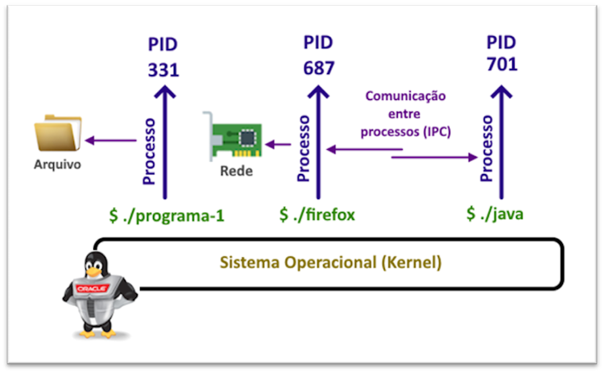
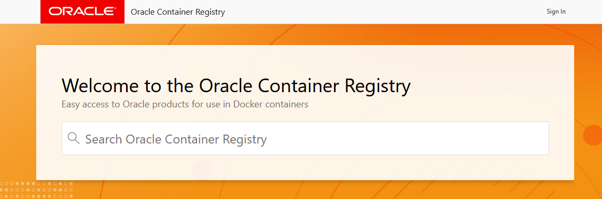
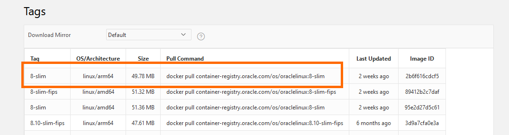
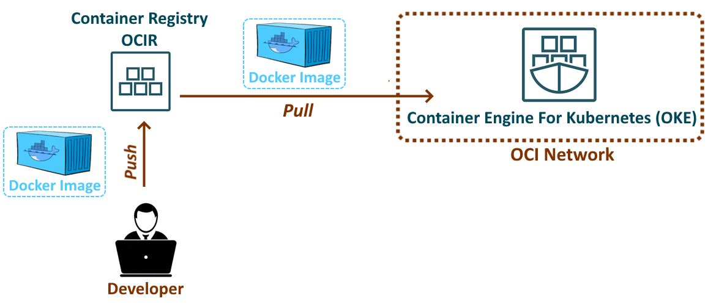
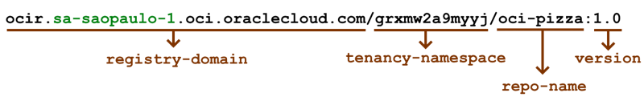

# 1. Entendendo os Contêineres

## Contêineres

Definir contêineres de forma concisa pode ser desafiador, pois envolve diversos conceitos interligados. Para facilitar a compreensão, apresentarei alguns princípios fundamentais que ajudarão a esclarecer o que são contêineres e como eles funcionam.

### Processos

Programa é uma entidade passiva onde as suas instruções são armazenadas em disco. Pode-se dizer também que, um programa é um _arquivo executável_. 

Assim que o programa é executado pelo usuário, ele se transforma em uma entidade ativa, com suas instruções sendo processadas pela CPU do computador. Em outras palavras, o programa passa a ser considerado um processo.

Em resumo, um processo é uma instância de um programa que está sendo executado.

Todo processo possui um número único, denominado PID (Process Identifier ou Identificador de Processo), que é utilizado para sua identificação no sistema operacional. Além disso, os processos têm a capacidade de se comunicar entre si, acessar arquivos e até mesmo enviar dados pela rede.



Os contêineres, ou Software Containers, foram desenvolvidos como uma solução eficaz para isolar a execução de processos dentro de um sistema operacional. Além dessa capacidade de isolamento, todo o conteúdo de um contêiner pode ser compactado em um único arquivo tarball, resultando no que chamamos de imagem de contêiner. Essa imagem contém tudo o que é necessário para executar o aplicativo, incluindo bibliotecas, dependências e configurações, garantindo um ambiente consistente e portátil.

>_**__NOTA:__** Isolar a execução de processos dentro de um mesmo sistema operacional não é uma ideia nova. Antes do surgimento dos contêineres, tecnologias como Solaris Zones e chroot já desempenhavam essa função, possibilitando a criação de ambientes isolados para a execução de aplicações._

Uma vez gerada, uma imagem de contêiner pode ser transportada e executada em qualquer ambiente que suporte a execução de contêineres. Em outras palavras, os contêineres permitem empacotar uma aplicação juntamente com todas as suas dependências (como frameworks, bibliotecas e arquivos de configuração) em um único _"pacote"_. Isso possibilita que esse pacote seja facilmente transferido e executado em plataformas como a _Oracle Cloud Infrastructure (OCI)_.

Os contêineres revolucionaram o desenvolvimento de software ao oferecer agilidade e simplificar o empacotamento e a distribuição de aplicações. Todas as dependências necessárias para uma aplicação estão incluídas dentro do contêiner, resultando em um pacote autocontido. Isso permite que o mesmo software seja executado em diferentes ambientes (desenvolvimento, teste e produção) sem a necessidade de realizar qualquer modificação.

### Docker

Docker é um conjunto de ferramentas desenvolvido para simplificar a criação, transporte e execução de contêineres. Ele utiliza funcionalidades do kernel do Linux, como namespaces e cgroups, para criar um _"espaço de trabalho isolado"_ conhecido como contêiner. Essa abordagem permite que os desenvolvedores empacotem aplicações e suas dependências de maneira consistente, assegurando que funcionem de forma idêntica em diferentes ambientes.

>_**__NOTA:__** Existem outras ferramentas disponíveis para criar e gerenciar contêineres, como o Podman, por exemplo. No entanto, o Docker continua sendo a ferramenta mais popular e amplamente utilizada no mercado.._

Contêineres não são máquinas virtuais. Enquanto uma máquina virtual inclui um sistema operacional completo e inicializável, um contêiner opera dentro de um sistema operacional existente. Isso significa que um único sistema operacional pode executar múltiplos contêineres, que são significativamente mais leves do que máquinas virtuais completas. Essa leveza permite um uso mais eficiente dos recursos, resultando em tempos de inicialização mais rápidos e uma maior densidade de aplicações em um mesmo ambiente.

### Container Registry

O _Container Registry_ é um serviço fundamental presenten no ecossistema de contêineres pois é ele quem permite armazenar, gerenciar e distribuir imagens de contêiner.

O Container Registry atua como um repositório centralizado onde os desenvolvedores podem armazenar suas imagens de contêiner. Essa funcionalidade permite que as equipes compartilhem e reutilizem imagens de forma eficiente em diversos ambientes, como desenvolvimento, teste e produção.

Além do _Docker Hub_, que é o maior registry público de imagens de contêiner, a Oracle também oferece o seu próprio registry público, acessível através do seguinte link:: [https://container-registry.oracle.com](https://container-registry.oracle.com/)



Uma das vantagens do [Oracle Container Registry](https://container-registry.oracle.com/) em comparação com o _Docker Hub_, é que o _Docker Hub_ impõe limites para o download das imagens que ele armazena (rate limits).  Em contrapartida, o Oracle Container Registry não aplica essas restrições, permitindo que os desenvolvedores baixem imagens da Oracle à vontade, sem se preocupar com limitações de uso.

Na aplicação _OCI Pizza_, foi utilizada como _imagem base_ o [Oracle Linux 8](https://container-registry.oracle.com/ords/ocr/ba/os/oraclelinux) na versão _slim_, que é uma imagem mais leve e compacta. Essa versão otimizada permite downloads e implantações mais ágeis, pois contém apenas os componentes essenciais do sistema operacional.



>_**__NOTA:__** Uma Docker Base Image (imagem base do Docker) é uma imagem de contêiner que serve como ponto de partida para a criação de outras imagens._

Para baixar a imagem [Oracle Linux 8 Slim](https://container-registry.oracle.com/ords/ocr/ba/os/oraclelinux) localmente em sua máquina, basta executar o comando abaixo:

```bash
$ docker pull container-registry.oracle.com/os/oraclelinux:8-slim
```

Com a _imagem baixada_ localmente, é possível criar um contêiner e iniciar um shell a partir do ID dessa _imagem base_:

```bash
$ docker images
REPOSITORY                                     TAG       IMAGE ID       CREATED       SIZE
container-registry.oracle.com/os/oraclelinux   8-slim    95e2d27d5c61   2 weeks ago   115MB
```

```bash
$ docker run -it 95e2d27d5c61 bash
bash-4.4# whoami
root
```

### Dockerfile

O Dockerfile é um arquivo de texto que contém todas as instruções necessárias para construir uma imagem de contêiner. O Dockerfile da aplicação _OCI Pizza_ inclui o seguinte conteúdo:

```bash
$ cat webapp/Dockerfile

#
# Dockerfile
#
FROM container-registry.oracle.com/os/oraclelinux:8-slim

LABEL maintainer="Daniel Armbrust <darmbrust@gmail.com>"

ENV PYTHONDONTWRITEBYTECODE=1
ENV PYTHONUNBUFFERED=1
ENV FLASK_APP=wsgi.py
ENV FLASK_DEBUG=0
ENV FLASK_ENV=production
ENV STATIC_URL=/static
ENV STATIC_PATH=/var/www/ocipizza/app/static

WORKDIR /var/www/ocipizza

COPY requirements.txt ./
COPY docker-entrypoint.sh ./

RUN microdnf update -y && \
    microdnf install -y gcc python38-devel python3.8 && \
    python -m ensurepip && \
    python -m pip install --no-cache-dir --upgrade pip setuptools && \
    python -m pip install --no-cache-dir -r requirements.txt && \
    microdnf clean all && rm -rf /var/cache/yum

RUN adduser -l -d /var/www/ocipizza webapp

COPY --chown=webapp:webapp ./ocipizza /var/www/ocipizza/

USER webapp
EXPOSE 5000

ENTRYPOINT ["./docker-entrypoint.sh"]
```

Abaixo, a explicação de alguns dos comandos existentes neste _Dockerfile_:

- [FROM](https://docs.docker.com/engine/reference/builder/#from) : Especifica a imagem base que será utilizada para criar uma nova imagem a partir dela. 

- [WORKDIR](https://docs.docker.com/engine/reference/builder/#workdir) : Durante o processo de construção da imagem, muda-se para o diretório especificado, estabelecendo-o como o novo diretório raiz de trabalho para a execução dos demais comandos.

- [COPY](https://docs.docker.com/engine/reference/builder/#copy) : Copia arquivos ou diretórios do sistema de arquivos externo para dentro da imagem em construção.

- [RUN](https://docs.docker.com/engine/reference/builder/#run) : Executa um comando como parte do processo de construção da imagem de contêiner.

- [EXPOSE](https://docs.docker.com/engine/reference/builder/#expose) : Especifica a porta de rede que a aplicação irá expor. É importante ressaltar que esta instrução "não abre" efetivamente nenhuma porta; ela serve apenas como uma forma de documentar qual porta será exposta pelo contêiner.

- [ENTRYPOINT](https://docs.docker.com/engine/reference/builder/#entrypoint) : Define o comando que será executado quando o contêiner for criado e iniciado. No caso deste exemplo, trata-se de um shell script que iniciará a aplicação web.

>_**__NOTA:__** Consulte [Dockerfile reference](https://docs.docker.com/engine/reference/builder/) para um descrição de todos os comandos suportados._

Para criar a imagem da aplicação, navegue até diretório que contém o arquivo Dockerfile:

```bash
$ cd webapp/
```

Em seguida, execute o comando abaixo e aguarde sua conclusão:

```bash
$ docker build -t ocipizza:1.0 .
```

>_**__NOTA:__** Lembre-se de estar dentro do diretório onde encontra-se o arquivo [Dockerfile](https://docs.docker.com/engine/reference/builder/) para poder executar o comando docker build._

O parâmetro _**-t** (ou --tag)_ do comando _docker build_, é utilizado para atribuir uma **_tag_** a uma imagem Docker. Essa tag serve como um identificador, permitindo nomear e versionar a imagem. Isto também facilita o gerenciamento de diferentes versões.

Por fim, é possível verificar que a imagem da aplicação foi criada com sucesso:

```
$ docker images
REPOSITORY                                     TAG       IMAGE ID       CREATED         SIZE
ocipizza                                       1.0       5f3324071ab8   4 seconds ago   665MB
container-registry.oracle.com/os/oraclelinux   8-slim    95e2d27d5c61   2 weeks ago     115MB
```

### Oracle Cloud Infrastructure Registry (OCIR)

Já sabemos que o Container Registry é um repositório utilizado para armazenar imagens de contêineres. No contexto do OCI, temos o [Oracle Cloud Infrastructure Registry (OCIR)](https://docs.oracle.com/en-us/iaas/Content/Registry/home.htm), que é um serviço gerenciado especificamente para o armazenamento e gerenciamento de imagens de contêineres.

O ideal é que todas as imagens de contêiner que serão implantadas e executadas por serviços no OCI, como o [OKE](https://docs.oracle.com/en-us/iaas/Content/ContEng/Concepts/contengoverview.htm) ou [Container Instances](https://docs.oracle.com/en-us/iaas/Content/container-instances/home.htm), sejam previamente armazenadas no [OCIR]((https://docs.oracle.com/en-us/iaas/Content/Registry/home.htm)).

Existem duas operações fundamentais relacionadas ao Container Registry:

1. **Push (Enviar)**: Esta operação envolve o envio de uma imagem de contêiner ao Container Registry (upload).

2. **Pull (Puxar)**: Esta operação refere-se à recuperação de uma imagem de contêiner do Container Registry para implantação e uso (download).



Antes de enviar a imagem por meio da operação _Push_, é necessário criar um _repositório_. O repositório servirá para armazenar diferentes versões de uma mesma imagem e pode ser configurado como _público_ ou _privado_. Um _repositório privado_ permite acesso apenas a partir dos recursos de uma VCN (Virtual Cloud Network), restringindo o acesso pela Internet.

Para criar um repositório privado, utilize o comando abaixo:

```bash
$ oci artifacts container repository create \
> --compartment-id "ocid1.compartment.oc1..aaaaaaaaaaaaaaaabbbbbbbbccc" \
> --display-name "ocipizza" \
> --wait-for-state "AVAILABLE"
```

Uma vez criado o repositório, é necessário nomear ou taguear (docker tag), seguindo o padrão estabelecido pelo OCI, que deve obedecer ao seguinte formato:


1. **registry-domain**: É o hostname que identifica o serviço OCIR dentro de uma região.

2. **tenancy-namespace**: É uma string que identifica unicamente um tenancy no OCI.

3. **repo-name**: Nome exclusivo de um repositório de imagens no OCIR usado para armazenar diferentes versões de uma aplicação.

4. **version**: Identificador de versão de uma imagem.

Para obter o valor do **tenancy-namespace**, utilize o comando abaixo:

```bash
$ oci os ns get
{
  "data": "grxmw2a9myyj"
}
```

No caso da aplicação _OCI Pizza_, ela será implantada na região **Brazil East (São Paulo)**, que possui o identificador **sa-saopaulo-1**. Diante disso, a nova _tag_ da aplicação é:



Para aplicar a nova _tag_ à imagem existente _ocipizza:1.0_, utilize o seguinte comando:

```bash
$ docker tag ocipizza:1.0 ocir.sa-saopaulo-1.oci.oraclecloud.com/grxmw2a9myyj/ocipizza:1.0
```

Antes de executar o _push_, é necessário fazer o login no serviço OCIR da região onde as imagens da aplicação serão enviadas (sa-saopaulo-1):

```bash
$ docker login ocir.sa-saopaulo-1.oci.oraclecloud.com
Username: grxmw2a9myyj/darmbrust@gmail.com
Password:
WARNING! Your password will be stored unencrypted in /home/darmbrust/.docker/config.json.
Configure a credential helper to remove this warning. See
https://docs.docker.com/engine/reference/commandline/login/#credentials-store

Login Succeeded
```

>_**__NOTA:__** Para efetuar o login no OCIR, é necessário possuir um nome de usuário válido, com as permissões adequadas, além de um [Auth Token](https://docs.oracle.com/en-us/iaas/Content/Registry/Tasks/registrygettingauthtoken.htm) que funcionará como a senha desse usuário no serviço OCIR. Para obter informações detalhadas sobre como gerar um Auth Token, consulte o [link](https://docs.oracle.com/en-us/iaas/Content/Registry/Tasks/registrygettingauthtoken.htm)._

Por último, executamos o _push_ para enviar a imagem da aplicação ao OCIR:

```bash
$ docker push ocir.sa-saopaulo-1.oci.oraclecloud.com/grxmw2a9myyj/ocipizza:1.0
```

Para exibir todas as imagens do repositório _ocipizza_, execute o comando abaixo:

```bash
$ oci artifacts container image list \
> --compartment-id "ocid1.compartment.oc1..aaaaaaaaaaaaaaaabbbbbbbbccc" \
> --all \
> --repository-name "ocipizza"
```

### Habilitando o Scan de Vulnerabilidades

Allow service vulnerability-scanning-service to read compartments in tenancy
Allow service vulnerability-scanning-service to read repos in tenancy

## Conclusão

Neste capítulo, abordamos a importância dos contêineres, o processo de construção de uma imagem de contêiner e como enviá-la para o serviço OCIR. Com isso, será possível implantar a aplicação em uma infraestrutura que suporte a execução de contêineres, tema que será explorado nos próximos capítulos.