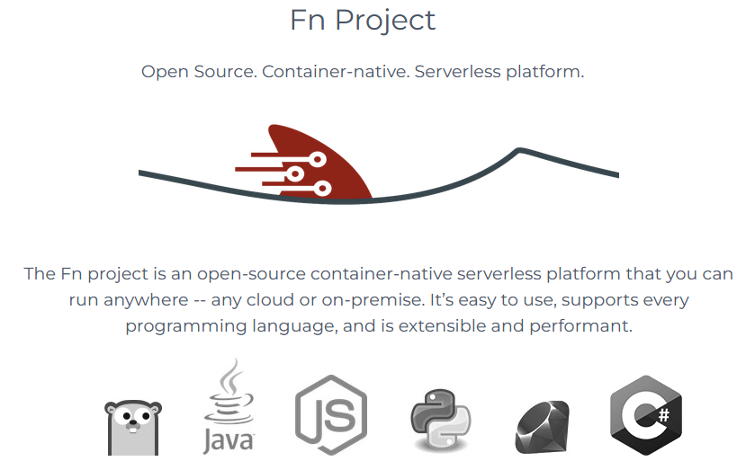
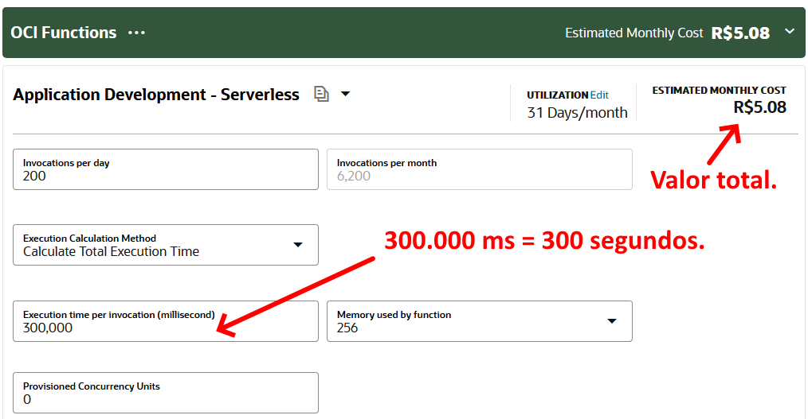
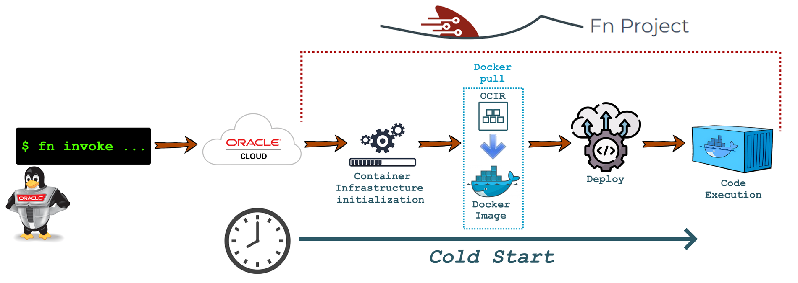
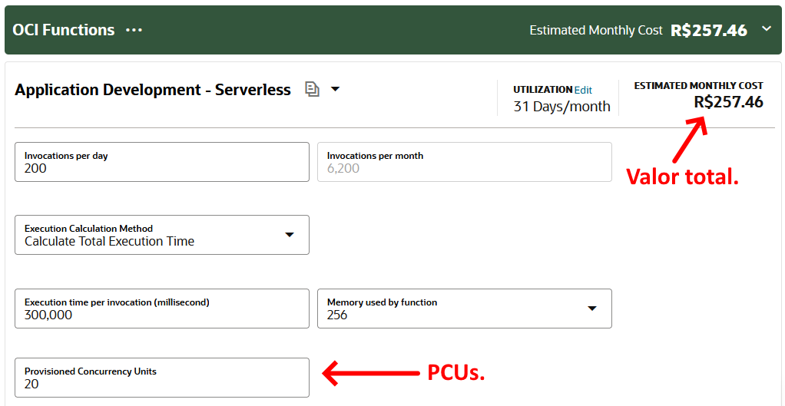
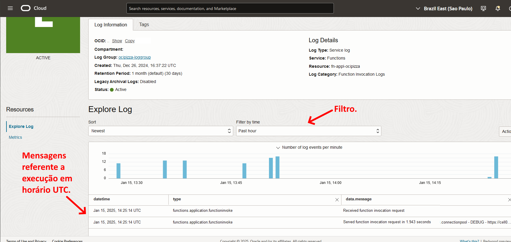

# 5.4 - Functions

[Oracle Functions](https://docs.oracle.com/en-us/iaas/Content/Functions/Concepts/functionsoverview.htm), ou simplesmente [Functions](https://docs.oracle.com/en-us/iaas/Content/Functions/Concepts/functionsoverview.htm), é uma plataforma _serverless_ que possibilita a criação e execução de códigos na infraestrutura do OCI, sem a necessidade de provisionar, configurar ou gerenciar servidores.

_Serverless_ é um termo que se refere a um modelo de computação em nuvem onde o gerenciamento da infraestrutura do servidor é abstraído do desenvolvedor. Embora o nome possa sugerir a ausência de servidores, na verdade, eles estão presentes, mas a sua administração é completamente gerenciada pelo provedor de nuvem. Isso permite que os desenvolvedores se concentrem na lógica de suas aplicações, sem se preocupar com a infraestrutura subjacente.

Em vez de precisar criar e configurar servidores, você simplesmente faz o deployment do seu código e o OCI se encarrega de provisionar a infraestrutura necessária para executar a sua aplicação. Isso inclui também a escalabilidade automática dos recursos utilizados, garantindo que sua aplicação possa se adaptar às variações de demanda sem a necessidade de intervenção manual.

O serviço OCI Functions é baseado no projeto de código aberto [Fn Project](https://fnproject.io/), que oferece uma plataforma de _Função como Serviço (FaaS - Function as a Service)_ para o desenvolvimento e execução de aplicações serverless. A escolha em usar um projeto de código aberto é evitar o _vendor lock-in_, comum em outras plataformas serverless. Aplicações desenvolvidas usando o Fn Project não estão sujeitas a esse lock-in, permitindo que sejam executadas localmente ou em qualquer outro provedor de nuvem.



>_**__NOTA:__** Os termos BaaS (Backend as a Service) ou FaaS (Function as a Service), também são usados para descrever este modelo computacional._

Embora o conceito de serverless possa parecer a solução mágica e definitiva para a construção de aplicações, ele não é uma _"bala de prata"_ que se aplica a todos os casos. Veremos que existem algumas limitações e seu uso exige uma nova abordagem na forma como as aplicações são desenvolvidas.

## Funções em Contêineres

Uma [função](https://docs.oracle.com/en-us/iaas/Content/Functions/Concepts/functionsoverview.htm) é, essencialmente, um contêiner que é executado na infraestrutura do OCI, seja por meio de uma chamada direta ou em resposta a um evento específico. O processo de construção da imagem do contêiner e seu envio para o [OCIR](https://docs.oracle.com/en-us/iaas/Content/Registry/home.htm) permanece o mesmo;  no entanto, é realizado de maneira diferente, utilizando a ferramenta de linha de comando fornecida pelo Fn Project.

>_**__NOTA:__** Por ser um contêiner, é possível criar seu próprio Dockerfile do zero em um processo conhecido como Bring-Your-Own-Dockerfile (BYOD). Para mais informações, consulte ["Using Custom Dockerfiles"](https://docs.oracle.com/en-us/iaas/Content/Functions/Tasks/functionsusingcustomdockerfiles.htm#Using_Custom_Docker_Files)._

As funções que você cria devem ser projetadas para executar uma única tarefa de forma simples e eficiente. O serviço não é destinado à execução de grandes aplicações e sim, pequenas tarefas, como, por exemplo, realizar um processamento de dados simples e, ao final, enviar um e-mail.

Aqui, já encontramos uma limitação em relação ao código que será executado como uma função: o tempo total de execução e a quantidade de memória disponível para que a função realize a sua tarefa.

Ao criar uma função, é obrigatório informar o _"tempo máximo de vida do contêiner"_ como também, a quantidade máxima de memória que ele pode utilizar. O tempo máximo de execução pode ser configurado entre _30 segundos_ até no máximo _300 segundos (5 minutos)_. Em relação à memória, é possível alocar no minímo _128 MB_ e no máximo _3072 MB (3 GB)_.

Isso significa que, se a execução da função ultrapassar o tempo máximo especificado, o OCI encerrará a função. Da mesma forma, se a função exigir mais memória do que a alocada, o OCI também encerrará a função. 

Outra limitação importante é a _quantidade máxima de dados_ que podem ser enviados para a função, bem como a quantidade máxima de dados que ela pode retornar. Esses limites são fixos em _6 MB_ e não podem ser alterados.

Essas limitações também se refletem na forma como o serviço é cobrado. A cobrança é baseada no tempo em que a função permanece ativa e na quantidade de memória alocada. Por exemplo, ao calcular rapidamente o custo do serviço para _200 chamadas por dia_, totalizando _6.200 chamadas por mês_ (200 * 31 = 6.200), com um tempo de execução de _300 segundos_ e utilização de _256 MB de memória_, o custo mensal seria de _R$ 5,08_.



>_**__NOTA:__** Sempre verifique o custo do serviço atráves do link [OCI Cost Estimator](https://www.oracle.com/cloud/costestimator.html) para obter valores atualizados._

É fundamental entender a tecnologia para projetar de forma eficaz o que pode ser transformado em uma função ou o que é mais apropriado para essa finalidade. Neste capítulo, utilizaremos como exemplo duas funcionalidades da aplicação OCI Pizza que utilizam o OCI Functions para enviar e-mails aos usuários finais.

## Cold Start e Hot Start

Como já mencionado, uma função é essencialmente um contêiner que é executado pelo OCI. Essa execução pode ser realizada por meio do utilitário de linha de comando fornecido pelo Fn Project, OCI CLI, SDKs, chamadas HTTP diretas ou em resposta a eventos configuráveis.

Toda execução de aplicações conteinerizadas segue o mesmo processo de deployment. Primeiramente, a imagem do contêiner é baixada do registro de imagens (OCIR) e, em seguida, é executada por uma infraestrutura que suporte a execução de contêineres por exemplo, [Container Instances](./docs/chapter-5/container-instances.md) ou [OKE](./docs/chapter-6/intro.md). 

O tempo total do processo de deployment, desde a inicialização até a disponibilização da função para processar a requisição é denominado **Cold Start**.

**Cold Start** é o termo utilizado em ambientes de computação serverless que se refere ao atraso inicial que ocorre quando uma função é invocado pela primeira vez ou após um período de inatividade _(idle time)_. Em outras palavras, é o tempo total que o provedor de nuvem leva para disponibilizar a função e, em seguida, executar o seu código.



Uma função que foi criada e permanece inativa por um certo período, é encerrada pelo OCI. Se ela for invocada novamente, o período de _cold start_ se reinicia para essa função. 

O período de _cold start_ não pode ser ajustado e é imprevisível, o que significa que não é possível estimar com precisão o tempo que o OCI levará para disponibilizar a função para uso. Essa é uma das características do serviço que deve ser levada em conta ao se projetar funções. 

Já o termo **Hot Start** tem um significado oposto. Quando uma função ainda está ativa ou, se a infraestrutura de execução estiver _"de pé"_, as requisições para essa função geralmente apresentam um tempo de resposta inferior a um segundo, pois não é necessário realizar todo o processo de deploy nesse caso.

É importante dizer que, requisições subsequentes são direcionadas ao mesmo contêiner. Se necessário, o OCI escala automaticamente a infraestrutura de forma horizontal para atender a um maior volume de requisições, até um limite máximo de _60 GB de memória_ para execução de todas as funções. Esse é o limite do tenancy, e, se necessário, é possível solicitar uma alteração para aumentar a capacidade máxima de memória.

## Provisioned Concurrency

Uma maneira de garantir que as funções estejam prontas para uso e evitar o cold start é utilizar o recurso _[Provisioned Concurrency](https://docs.oracle.com/en-us/iaas/Content/Functions/Tasks/functionsusingprovisionedconcurrency.htm#functionsusingprovisionedconcurrency)_. Essa funcionalidade assegura que a infraestrutura de execução permaneça disponível para um número mínimo de invocações simultâneas, permitindo que as funções sejam acionadas rapidamente.

Provisioned Concurrency é medido em _"provisioned concurrency units" (PCUs)_. Você determina a quantidade de PCUs com base no número de invocações concorrentes que você espera para a função. Ao especificar PCUs, a infraestrutura de execução da função se torna dedicada a você e está sempre disponível. No entanto, essa disponibilidade contínua resulta em um custo mais elevado.



Para a aplicação OCI Pizza, não será definido nenhum valor para Provisioned Concurrency, uma vez que as funções da aplicação podem tolerar o cold start. Para mais informações sobre o assunto, consulte _["Reducing Initial Latency Using Provisioned Concurrency"](https://docs.oracle.com/en-us/iaas/Content/Functions/Tasks/functionsusingprovisionedconcurrency.htm#functionsusingprovisionedconcurrency)_.

## Criando Funções

Agora que a teoria e as limitações do uso de funções foram abordadas, é hora de aplicar esse conhecimento na prática e preparar o ambiente para o desenvolvimento de funções.

>_**__NOTA:__** O passo a passo para a instalação do Fn Project e a preparação do ambiente é baseado no documento ["Functions QuickStart on Local Host"](https://docs.oracle.com/en-us/iaas/Content/Functions/Tasks/functionsquickstartlocalhost.htm#functionsquickstartlocalhost)._

### Instalação do Fn Project

Primeiramente, na sua máquina local, deve-se instalar o Fn Project através do comando abaixo:

```bash
$ curl -LSs https://raw.githubusercontent.com/fnproject/cli/master/install | sh
[sudo] password for darmbrust:
fn version 0.6.36

        ______
       / ____/___
      / /_  / __ \
     / __/ / / / /
    /_/   /_/ /_/`
```

Uma forma de verificar se a instalação foi concluída com sucesso é através do comando _[fn](https://github.com/fnproject/docs/tree/master/cli)_ que acaba de ser instalado:

```bash
$ fn version
Client version is latest version: 0.6.36
Server version:  ?
```

>_**__NOTA:__** Para mais informações sobre a instalação do Fn Project, consulte [Fn Installation](https://fnproject.io/tutorials/install/)._

### Function Application

Toda função antes de ser criada, deve fazer parte de um _[Application](https://docs.oracle.com/en-us/iaas/Content/Functions/Concepts/functionsconcepts.htm#applications)_, que serve como um meio de agrupar funções com configurações comuns no OCI.

As funções dentro de um mesmo Application compartilham a mesma sub-rede, utilizam as mesmas variáveis de ambiente e a mesma arquitetura de processador, possuem configurações de log em comum e são executadas de forma isolada em relação a outras Applications.

A aplicação OCI Pizza utiliza um Application por região para agrupar suas funções, que será criada especificando a sub-rede privada (subnprv) e algumas variáveis de ambiente necessárias.

O comando abaixo cria a Application na região _Brazil East (São Paulo)_:

```bash
$ oci --region "sa-saopaulo-1" fn application create \
> --compartment-id "ocid1.compartment.oc1..aaaaaaaaaaaaaaaabbbbbbbbccc" \
> --display-name "fn-appl-ocipizza" \
> --subnet-ids "[\"ocid1.subnet.oc1.sa-saopaulo-1.aaaaaaaaaaaaaaaabbbbbbbbccc\"]" \
> --config "{ 
>     \"OCI_REGION\": \"sa-saopaulo-1\",
>     \"ENV\": \"prd\",    
>     \"NOSQL_COMPARTMENT_OCID\": \"ocid1.compartment.oc1..aaaaaaaaaaaaaaaabbbbbbbbccc\",
>     \"EMAIL_COMPARTMENT_OCID\": \"ocid1.compartment.oc1..aaaaaaaaaaaaaaaabbbbbbbbccc\"}" \
> --shape "GENERIC_X86" \
> --wait-for-state "ACTIVE"
```

>_**__NOTA:__** A sub-rede utilizada deve ter pelo menos um determinado número mínimo de endereços IP livres para uso do OCI Functions. Consulte [CIDR Blocks and OCI Functions](https://docs.oracle.com/en-us/iaas/Content/Functions/Tasks/functionscidrblocks.htm) para maiores detalhes._

### Habilitando a captura dos Logs

Toda função, ao ser executada, gera logs. Para facilitar a análise de possíveis problemas que possam impedir a execução correta da função, é uma boa prática habilitar o registro desses logs.

Para habilitar os logs de execução das funções, primeiro é necessário obter o OCID do [Log Group](https://docs.oracle.com/en-us/iaas/Content/Logging/Task/managinglogs.htm) que foi criado na seção do Capítulo 1

```bash
$ oci --region "sa-saopaulo-1" logging log-group list \
> --compartment-id "ocid1.compartment.oc1..aaaaaaaaaaaaaaaabbbbbbbbccc" \
> --all \
> --display-name "ocipizza-loggroup" \
> --query 'data[].id'
[
  "ocid1.loggroup.oc1.sa-saopaulo-1.aaaaaaaaaaaaaaaabbbbbbbbccc"
]
```

Em seguida, obtenha o OCID do Application:

```bash
$ oci --region "sa-saopaulo-1" fn application list \
> --compartment-id "ocid1.compartment.oc1..aaaaaaaaaaaaaaaabbbbbbbbccc" \
> --display-name "fn-appl-ocipizza" \
> --lifecycle-state "ACTIVE" \
> --query 'data[].id'
[
  "ocid1.fnapp.oc1.sa-saopaulo-1.aaaaaaaaaaaaaaaabbbbbbbbccc"
]
```

Com essas informações, já é possível habilitar os logs para a execução das funções:

```bash
$ oci --region "sa-saopaulo-1" logging log create \
> --log-group-id "ocid1.loggroup.oc1.sa-saopaulo-1.aaaaaaaaaaaaaaaabbbbbbbbccc" \
> --display-name "log-service-fn" \
> --log-type "SERVICE" \
> --retention-duration 30 \
> --is-enabled "true" \
> --configuration "{
>     \"archiving\": {
>         \"isEnabled\": false
>     },
>     \"compartmentId\": \"ocid1.compartment.oc1..aaaaaaaaaaaaaaaabbbbbbbbccc\",
>     \"source\": {
>         \"category\": \"invoke\",
>         \"resource\": \"ocid1.fnapp.oc1.sa-saopaulo-1.aaaaaaaaaaaaaaaabbbbbbbbccc\",
>         \"service\": \"functions\",
>         \"sourceType\": \"OCISERVICE\"}}" \
> --wait-for-state "SUCCEEDED"
```

### Configurações iniciais do Fn Project

Antes de construir funções é necessário configurar o Fn Project de acordo com alguns parametrôs do OCI.

1. Criar um contexto de utilização especificando o parâmetro _--provider oracle_:

```bash
$ fn create context ocipizza-ctx --provider oracle
Successfully created context: ocipizza-ctx
```

2. Após, utilize o _[contexto](https://github.com/fnproject/docs/blob/master/cli/ref/fn-create-context.md)_ que foi recentemente criado:

```bash
$ fn use context ocipizza-ctx
Now using context: ocipizza-ctx
```

3. Atualize o contexto com as informações referentes ao OCID do compartimento onde as funções serão implantadas, ao OCID do compartimento que armazena as imagens de contêiner (serviço OCIR), à URL da região para o endpoint das funções e à URL do repositório de imagens para onde as imagens serão enviadas (push) e baixadas (pull): 

```bash
$ fn update context oracle.compartment-id ocid1.compartment.oc1..aaaaaaaaaaaaaaaabbbbbbbbccc
```

```bash
$ fn update context oracle.image-compartment-id ocid1.compartment.oc1..aaaaaaaaaaaaaaaabbbbbbbbccc
```

```bash
$ fn update context api-url https://functions.sa-saopaulo-1.oci.oraclecloud.com
```

```bash
$ fn update context registry gru.ocir.io/grxmw2a9myyj/fn-repo
```

4. Por fim, é necessário fazer login no serviço OCIR da região:

```bash
$ docker login -u 'grxmw2a9myyj/darmbrust@gmail.com' gru.ocir.io
```

>_**__NOTA:__** Para obter mais informações sobre os comandos utilizados, consulte [Functions QuickStart on Local Host](https://docs.oracle.com/en-us/iaas/Content/Functions/Tasks/functionsquickstartlocalhost.htm#functionsquickstartlocalhost)._

### Funções da aplicação OCI Pizza

Existem duas funções localizadas no diretório _"services/"_ que são utilizadas pela aplicação OCI Pizza:

- **fn-user-registry-email**

    - Função destinada a registrar um novo usuário. 
    - Após o usuário submeter seus dados de cadastro, a função insere essas informações no banco de dados e, em seguida, envia um e-mail ao usuário para confirmar e efetivar o seu cadastro.

- **fn-password-recovery-email**

    - Função destinada para recuperação de senha do usuário.
    - Essa função será executada para gerar um link de recuperação de senha, que será enviado ao usuário por e-mail.

Ambas as fuções, após o seu devido processamento, utilizam o serviço [Email Delivery](../chapter-3/email-delivery.md) para enviar um e-mail ao usuário.

>_**__NOTA:__** Aqui, apresentarei os detalhes sobre como criar uma função, utilizando como exemplo a função "fn-password-recovery-email". Os mesmos comandos devem ser aplicados à função "fn-user-registry-email" para que a aplicação OCI Pizza funcione por completo._

Depois de todo o ambiente local do _[Fn Project](https://fnproject.io/)_ estar configurado, a função é criada utilizando o comando _[fn init](https://github.com/fnproject/docs/blob/master/cli/ref/fn-init.md)_:

```bash
$ fn init --runtime python3.8 --memory 256 --timeout 120 fn-password-recovery-email
Creating function at: ./fn-password-recovery-email
Function boilerplate generated.
func.yaml created.
```

Note que, no comando acima, além de definir a _memória alocada (--memory)_ e o _tempo máximo de execução (--timeout)_, é obrigatório especificar o _ambiente de execução_ responsável por executar o código da função _(--runtime)_. Para a aplicação OCI Pizza, todo o código foi desenvolvido na linguagem de programação Python, versão 3.8 _(python3.8)_.

>_**__NOTA:__** OCI Functions oferece suporte a diversas linguagens de programação. Para verificar se a sua linguagem de programação é suportada, consulte o link ["Languages Supported by OCI Functions"](https://docs.oracle.com/en-us/iaas/Content/Functions/Tasks/languagessupportedbyfunctions.htm#functionssupportedlanguageversions_topic_Language_versions_supported_by_FDKs)._

O comando _fn init_ cria o diretório _"fn-password-recovery-email/"_ com três arquivos:

```bash
$ ls -1 fn-password-recovery-email/
func.py
func.yaml
requirements.txt
```

- **func.py**

    - Arquivo principal e o primeiro a ser chamado quando a função é invocada.

- **func.yaml**

    - Arquivo de configuração da função que contém informações essenciais para sua execução. 

- **requirements.txt**

    - Arquito que contém a lista de depêndencias Python necessárias para executar a função.

Por ser um contêiner, a função permite a criação de diretórios, a adição de pacotes extras e o desenvolvimento de bibliotecas específicas, entre outras personalizações. No entanto, é importante notar que quanto maior o tamanho da função, mais tempo será necessário para o seu deployment. Além disso, quanto mais funcionalidades forem incorporadas, maior será a demanda de memória durante a execução da função.

A função _fn-password-recovery-email_ apresenta a seguinte estrutura de arquivos e diretórios:

```bash
$ tree .
.
├── func.py
├── func.yaml
├── modules
│   ├── __init__.py
│   ├── email.py
│   ├── nosql.py
│   ├── user.py
│   └── utils.py
└── requirements.txt

1 directory, 8 files
```

### Build e Push

Para construir a imagem da função, dentro do diretório _"fn-password-recovery-email/"_ e execute o comando _[fn build](https://github.com/fnproject/docs/blob/master/cli/ref/fn-build.md)_:

```bash
$ fn -v build
```

Por fim, é necessário enviar a imagem para o OCIR utilizando o comando _[fn push](https://github.com/fnproject/docs/blob/master/cli/ref/fn-push.md)_:

```bash
$ fn -v push
```

>_**__NOTA:__** O comando [fn deploy](https://github.com/fnproject/docs/blob/master/cli/ref/fn-deploy.md) combina a execução dos comandos [fn build](https://github.com/fnproject/docs/blob/master/cli/ref/fn-build.md) e [fn push](https://github.com/fnproject/docs/blob/master/cli/ref/fn-push.md). Além de realizar essas operações simultaneamente, ele também atualiza a versão da função para cada nova execução._

### Criando a função no OCI

Uma vez que a imagem da função está disponível no OCIR, o próximo passo é criar a função no OCI. Para isso, é necessário especificar a quantidade de memória a ser alocada, o tempo máximo de execução e a URL completa da imagem correspondente à região onde a função será executada:

```bash
$ oci --region "sa-saopaulo-1" fn function create \
> --application-id "ocid1.fnapp.oc1.sa-saopaulo-1.aaaaaaaaaaaaaaaabbbbbbbbccc" \
> --display-name "fn-password-recovery-email" \
> --memory-in-mbs 256 \
> --timeout-in-seconds 120 \
> --image "gru.ocir.io/grxmw2a9myyj/fn-repo/fn-password-recovery-email:0.0.1" \
> --wait-for-state "ACTIVE"
```

### Executando a Função

Existem diferentes maneiras de executar uma função que já foi criada e configurada no OCI. São elas:

- Utilizando o comando _[fn invoke](https://docs.oracle.com/en-us/iaas/Content/Functions/Tasks/functionsinvokingfunctions.htm#usingfncli)_.

- Por meio do OCI CLI.

- Por meio dos SDKs do OCI.

- Por meio de uma chamada HTTP assinada.

Os métodos _fn invoke_, _OCI CLI_ e _SDKs_ constroem automaticamente a requisição para se comunicar com as APIs do OCI. Por outro lado, ao utilizar o método _"HTTP assinado"_, você precisará criar manualmente a requisição que será enviada às APIs do OCI. Isso inclui a geração de uma assinatura válida e a inclusão do respectivo OCID do compartimento onde a função está localizada. Essas informações devem ser inseridas no cabeçalho HTTP que será utilizado para chamar a função.

>_**__NOTA:__** Consulte ["Invoking Functions"](https://docs.oracle.com/en-us/iaas/Content/Functions/Tasks/functionsinvokingfunctions.htm#Invoking_Functions) para obter mais informações sobre os diferentes métodos de execução de uma função._

Aqui, será usado o comando _fn invoke_ para chamar a função _"fn-password-recovery-email"_:

```bash
$ echo -n '{"email": "darmbrust@gmail.com"}' | fn invoke fn-appl-ocipizza fn-password-recovery-email | jq .
{
  "status": "success",
  "message": "E-mail for password recovery sent successfully.",
  "data": {
    "email": "darmbrust@gmail.com"
  }
}
```

>_**__NOTA:__** O comando [jq](https://jqlang.github.io/jq/), usado no final da linha de comando, não é necessário. Ele foi utilizado apenas para formatar a resposta retornada da função, tornando-a mais legível._

Um último detalhe a ser observado sobre o tempo de _cold start_: utilizando o utilitário de linha de comando _[time](https://www.man7.org/linux/man-pages/man1/time.1.html)_, é possível verificar que a primeira execução da função levou quase _16 segundos_ para completar. Esse foi o tempo total que o OCI levou para preparar a função, incluindo o tempo necessário para a execução do código e o tempo do _fn invoke_.

```bash
real    0m15.932s
user    0m0.118s
sys     0m0.056s
```

Na segunda execução, com a infraestrutura ainda ativa _(hot start)_, o tempo total foi de aproximadamente _1 segundo_:

```bash
real    0m1.010s
user    0m0.092s
sys     0m0.062s
```

É importante lembrar que o período de _cold start_ é imprevisível, e esses valores podem variar, podendo ser maiores ou menores.

### Exibindo os logs de execução

Para verificar os logs relacionados à execução da função, recomendo consultar o Console da Web. Essa opção facilita a aplicação de filtros e proporciona uma visualização mais intuitiva das informações.



A sintaxe para visualizar os logs por meio do OCI CLI é mais complexa e geralmente é utilizada quando se deseja enviar os logs para processamento em outra aplicação. De qualquer forma, aqui está um exemplo de comando:

```bash
$ oci --region "sa-saopaulo-1" logging-search search-logs \
> --search-query "search
>     \"ocid1.compartment.oc1..aaaaaaaaaaaaaaaabbbbbbbbccc/ocid1.loggroup.oc1.sa-saopaulo-1.aaaaaaaaaaaaaaaabbbbbbbbccc/ocid1.log.oc1.sa-saopaulo-1.aaaaaaaaaaaaaaaabbbbbbbbccc\"
>     | sort by datetime desc" \
> --time-start "2025-01-15T13:20:52.684Z" \
> --time-end "2025-01-15T14:20:52.684Z" \
> --is-return-field-info false \
> --limit 2
```

Lembre-se de que o horário em que o OCI registra as informações é em UTC. No exemplo acima, o comando _fn invoke_ foi executado às 10:20:52 no meu horário local (GMT-3).

>_**__NOTA:__** Consulte [Logging Query Language Specification](https://docs.oracle.com/en-us/iaas/Content/Logging/Reference/query_language_specification.htm) para obter mais informações sobre a sintaxe utilizada pelo OCI para consultar logs._

## Conclusão

Neste capítulo, exploramos as funcionalidades e características do OCI Functions, uma plataforma _serverless_ no qual é possibilida a execução de código em contêineres. 

Funções são úteis para desacoplar funcionalidades de uma aplicação maior ou, em alguns casos, para executar códigos que podem levar um certo tempo para gerar uma resposta.

Além disso, discutimos algumas particularidades que devem ser consideradas ao projetar funções, como o tempo de cold start, o tempo máximo de vida do contêiner e a alocação de memória. Todos esses detalhes devem ser levados conta ao se projetar funções, visto que uma função é destinada para execução de uma única tarefa.