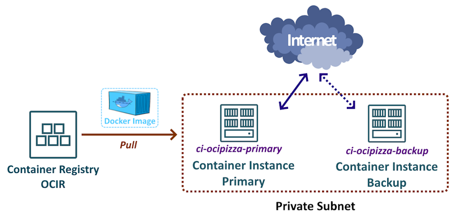

# 2. Container Instances

A maneira mais rápida e prática de executar uma aplicação conteinerizada no OCI,  é através do serviço [Container Instances](https://docs.oracle.com/en-us/iaas/Content/container-instances/overview-of-container-instances.htm#overview-of-container-instances).

Container Instances é um serviço de computação serverless que permite a execução rápida e simplificada de contêineres, eliminando a necessidade de gerenciamento de servidores. Ele opera de forma semelhante a uma máquina virtual, permitindo que você configure o tipo de processador, a quantidade de CPU e a memória. No entanto, em vez de especificar uma versão de sistema operacional, como o [Oracle Linux](https://www.oracle.com/linux/technologies/oracle-linux-downloads.html), você define a imagem de contêiner a ser utilizada.

O serviço é ideal para executar workloads mais simples que não requerem plataformas de orquestração de contêineres mais complexas, como o [Kubernetes](https://docs.oracle.com/en-us/iaas/Content/ContEng/home.htm).

O Container Instances oferece flexibilidade ao permitir a execução de um ou mais contêineres simultaneamente. Além disso, possibilita a configuração de variáveis de ambiente, a definição de políticas de _restart_, ajustes nas opções de inicialização e diversas outras configurações.

Para a aplicação OCI Pizza, serão implementados dois Container Instances. O primeiro será o contêiner primário, responsável por receber os acessos provenientes da Internet, enquanto o segundo funcionará como um Container Instance de backup, assegurando a continuidade do serviço em caso de falha no primário. Essa estratégia oferece maior resiliência e disponibilidade, garantindo que a aplicação permaneça operante mesmo diante de imprevistos.



## Compute Shape

Primeiramente, ao criar um Container Instance, é necessário escolher um dos Compute Shapes disponíveis. Os shapes que terminam com ".Flex" são shapes flexíveis, permitindo que você defina tanto o número de OCPUs quanto a quantidade de memória RAM que o contêiner pode utilizar.

Para listar os shapes disponíveis para uso, utilize o comando abaixo:

```
$ oci container-instances container-instance list-shapes \
    --compartment-id "ocid1.compartment.oc1..aaaaaaaaaaaaaaaabbbbbbbbccc" \
    --all \
    --query 'data.items[].{Shape:name}' \
    --output table

+----------------------------+
| Shape                      |
+----------------------------+
| CI.Standard.A1.Flex        |
| CI.Standard.Ampere.Generic |
| CI.Standard.E3.Flex        |
| CI.Standard.E4.Flex        |
| CI.Standard.x86.Generic    |
+----------------------------+
```

É importante ressaltar que cada shape possui limitações em relação à quantidade máxima de OCPUs, memória e largura de banda de rede. Por exemplo, o comando abaixo lista todas as propriedades de todos os shapes:

```
$ oci container-instances container-instance list-shapes \
    --compartment-id "ocid1.compartment.oc1..aaaaaaaaaaaaaaaabbbbbbbbccc" \
    --all
```

>_**__NOTA:__** Para obter mais detalhes sobre os shapes disponíveis para Container Instances, consulte a documentação oficial neste [link](https://docs.oracle.com/en-us/iaas/Content/container-instances/container-instance-shapes.htm#container-instance-shapes)._

Para a aplicação OCI Pizza, será usado o shape CI.Standard.E4.Flex com 4 GB de memória RAM e 2 OCPUs.

## Rede

O Container Instance 