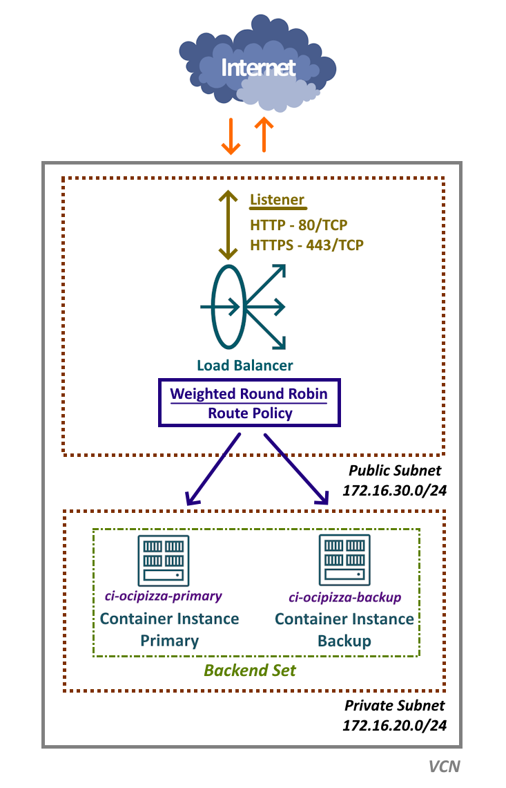

# 4. Expondo a aplicação por meio do Load Balancer

[Load Balancer](https://docs.oracle.com/en-us/iaas/Content/Balance/home.htm), também conhecido como Balanceador de Carga ou LBaaS, é um serviço disponível no OCI que desempenha um papel crucial na distribuição do tráfego de rede entre múltiplos servidores de aplicação _"saudáveis"_. Essa funcionalidade é essencial para garantir que as aplicações permaneçam disponíveis e operem de maneira eficiente, otimizando o desempenho e a resiliência do sistema.

De um modo geral, sua principal função é direcionar o tráfego de rede de um ponto de entrada para vários servidores de aplicação. Isso não apenas otimiza a utilização dos recursos, mas também possibilita o escalonamento da aplicação. Ao utilizar multiplos servidores, o Load Balancer promove a alta disponibilidade e elimina o risco de um ponto único de falha. Sua aplicação então, torna-se tolerante a falhas.

De maneira geral, a principal função do Load Balancer é direcionar o tráfego de rede de um ponto de entrada para diversos servidores de aplicação. Essa abordagem não apenas otimiza a utilização dos recursos, mas também permite o escalonamento eficiente da aplicação. Ao empregar múltiplos servidores, o Load Balancer garante alta disponibilidade e elimina o risco de um ponto único de falha, tornando a aplicação mais resiliente e tolerante a falhas.

>_**__NOTA:__** A expressão "escalonamento eficiente da aplicação" refere-se à capacidade de ajustar os recursos alocados a uma aplicação, aumentando ou diminuindo conforme necessário, para atender à demanda dinâmica de acessos. Essa abordagem visa otimizar o uso de recursos, evitando desperdícios e garantindo que o desempenho da aplicação não seja comprometido._

No OCI, estão disponíveis dois tipos de balanceadores:

- **[Load Balancer ou Application Load Balancer (ALB)](https://docs.oracle.com/en-us/iaas/Content/Balance/home.htm)**
    - Este é um balanceador de carga que opera na [Camada 7](https://www.geeksforgeeks.org/application-layer-in-osi-model/) do modelo OSI para os protocolos [HTTP](https://en.wikipedia.org/wiki/HTTP), [HTTPS](https://en.wikipedia.org/wiki/HTTPS), [HTTP/2](https://en.wikipedia.org/wiki/HTTP/2) e [gRPC](https://en.wikipedia.org/wiki/GRPC).

- **[Network Load Balancer (NLB)](https://docs.oracle.com/en-us/iaas/Content/NetworkLoadBalancer/home.htm)**
    - Este é um balanceador de carga que opera na [Camada 4](https://www.geeksforgeeks.org/transport-layer-in-osi-model/) do modelo OSI para os protocolos [TCP](https://en.wikipedia.org/wiki/Transmission_Control_Protocol) e [UDP](https://en.wikipedia.org/wiki/User_Datagram_Protocol).

Para a aplicação OCI Pizza, que é uma aplicação web, será utilizado um Load Balancer de Camada 7.

## Visão geral do Load Balancer

Antes de avançar com a criação do Load Balancer que será utilizado pela aplicação, é importante compreender alguns dos seus conceitos.

- **Load Balancer Público ou Privado**
    - Um [Load Balancer Público](https://docs.oracle.com/en-us/iaas/Content/Balance/Concepts/load_balancer_types.htm#LoadBalancerTypes__public-lb) é configurado em uma sub-rede pública e possui um endereço IP público, o que o torna acessível diretamente pela Internet. 
   - Por outro lado, um [Load Balancer Privado](https://docs.oracle.com/en-us/iaas/Content/Balance/Concepts/load_balancer_types.htm#LoadBalancerTypes__PrivateLoadBalancers) é configurado em uma sub-rede privada, com o objetivo de não receber requisições da Internet, operando exclusivamente com recursos internos.

- **Listener**
    - Um [Listener](https://docs.oracle.com/en-us/iaas/Content/Balance/Tasks/managinglisteners.htm#ListenerManagement) é a porta TCP através da qual o Load Balancer recebe requisições de rede.
    - Para o Network Load Balancer, é possível utilizar tanto uma porta TCP quanto uma porta UDP.
    - Em um balanceador, é possível configurar múltiplos Listeners em diferentes portas.

- **Backend Set e Backend Servers**
    - Um [Backend Set](https://docs.oracle.com/en-us/iaas/Content/Balance/Tasks/managingbackendsets.htm) é um grupo de [Backend Servers](https://docs.oracle.com/en-us/iaas/Content/Balance/Tasks/managingbackendservers.htm).
    - Os Backend Servers são os servidores de aplicação agrupados em um Backend Set, que compartilham um conjunto comum de configurações, incluindo [políticas de balanceamento](https://docs.oracle.com/en-us/iaas/Content/Balance/Reference/lbpolicies.htm) e verificações de [health check](https://docs.oracle.com/en-us/iaas/Content/Balance/Tasks/load_balancer_health_management.htm).

- **Health Check**
    - [Health Check](https://docs.oracle.com/en-us/iaas/Content/Balance/Tasks/load_balancer_health_management.htm) ou monitoramento, é um teste realizado pelo Load Balancer para verificar a disponibilidade e o funcionamento adequado de um servidor de aplicação.
    - Se o teste de Health Check falhar para um servidor de aplicação, o Load Balancer interrompe temporariamente o envio de tráfego para esse servidor. O monitoramento continua, e, caso o servidor retorne ao estado saudável (healthy), ele volta a receber tráfego de rede.
    - Os testes podem ser configurados em nível TCP, que apenas confirma se o servidor está acessível na rede (por meio da abertura de um socket), ou através de HTTP, utilizando uma URI específica. O teste HTTP não só verifica a acessibilidade do servidor, mas também assegura que a aplicação esteja funcionando corretamente.

- **Política de Balanceamento**
    - A Política de Balanceamento determina a forma como o tráfego de entrada é distribuído entre os Backend Sets, que agrupam os servidores de aplicação.
    - Atualmente, existem três diferentes Políticas de Balanceamento que podem ser utilizadas no Load Balancer de Camada 7:    
        1. [Weighted Round Robin (Revezamento)](https://docs.oracle.com/en-us/iaas/Content/Balance/Reference/lbpolicies.htm#Policies__RoundRobin)
            - É um algoritmo de balanceamento simples que distribui o tráfego de maneira sequencial entre os servidores de aplicação presentes no Backend Set.
            - Esta é uma política que funciona melhor quando todos os servidores de aplicação do Backend Set possuem capacidade computacional igual.
        2. [IP hash](https://docs.oracle.com/en-us/iaas/Content/Balance/Reference/lbpolicies.htm#Policies__IPHash)
            - Essa política calcula um hash com base no IP de origem de uma solicitação recebida, visando direcionar o tráfego para o mesmo servidor de aplicação. Isso assegura que as solicitações de um cliente específico sejam sempre encaminhadas para o mesmo servidor no Backend Set.
        3. [Least connections (Menos conexões)](https://docs.oracle.com/en-us/iaas/Content/Balance/Reference/lbpolicies.htm#Policies__LeastConnections)
            - Essa política direciona o tráfego para o servidor de aplicação no Backend Set que possui o menor número de conexões ativas.

- **HTTPS e certificados SSL**
    - O Load Balancer permite tratar conexões seguras através da configuração de um Listener que utiliza o protocolo HTTPS. Isso requer a utilização de um certificado digital.
    - Existem diferentes abordagens para gerenciar conexões criptografadas via SSL no Load Balancer, incluindo:
        1. [Terminação SSL no Load Balancer](https://docs.oracle.com/en-us/iaas/Content/Balance/Tasks/managingcertificates.htm#configuringSSLhandling__TerminatnigLoadBalancer)
            - Este é o método mais comum, no qual o tráfego é criptografado até o Listener do Load Balancer, enquanto a comunicação com o Backend Set não é criptografada.
        2. [SSL Backend](https://docs.oracle.com/en-us/iaas/Content/Balance/Tasks/managingcertificates.htm#configuringSSLhandling__TerminatnigLoadBalancer)
            - O tráfego entre o Load Balancer e os servidores do Backend Set é criptografado.
        3. [SSL Ponto-a-Ponto](https://docs.oracle.com/en-us/iaas/Content/Balance/Tasks/managingcertificates.htm#configuringSSLhandling__ImplementEndtoEndSSL)
            - O Load Balancer aceita tráfego criptografado e também criptografa o tráfego que é enviado para o backend.

- **Shape**
    - O Shape determina a capacidade total máxima pré-provisionada do Load Balancer, especificando a largura de banda disponível para o tráfego de entrada e saída. Essa configuração estabelece limites de largura de banda que começam em 10 Mbps e podem chegar até 8000 Mbps.

## Load Balancer da aplicação OCI Pizza

