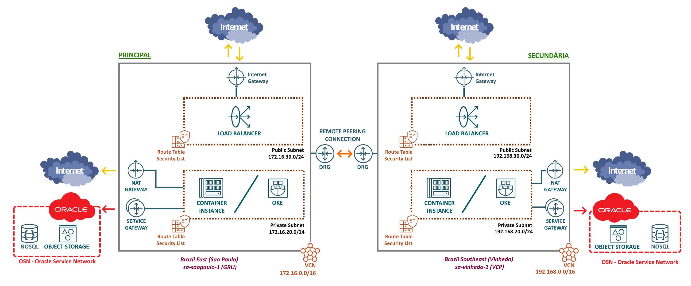

# O Serviço de Redes do OCI

Antes de iniciar a criação de qualquer recurso no OCI, é necessário configurar uma rede. Isso se deve ao fato de que a maioria dos serviços disponíveis no OCI, assim como os serviços que serão utilizados pela aplicação OCI Pizza, dependem de uma rede adequadamente configurada e pronta para uso.

>_**__NOTA:__** Um recurso, no contexto de computação em nuvem e tecnologia da informação, refere-se a qualquer componente ou serviço que pode ser utilizado para construir, implementar e gerenciar aplicações e sistemas._

O [Serviço de Redes](https://docs.oracle.com/en-us/iaas/Content/Network/Concepts/landing.htm) do OCI disponibiliza versões virtuais da maioria dos componentes de redes tradicionais que conhecemos. A configuração da rede é um pré-requisito essencial para o funcionamento de qualquer aplicação na nuvem.

A topologia de rede a seguir será adotada para a aplicação OCI Pizza:



## Descrição dos Componentes da Rede

A seguir, serão descritos os componentes de rede utilizados pela aplicação OCI Pizza.

- **[VCN (Virtual Cloud Network)](https://docs.oracle.com/en-us/iaas/Content/Network/Tasks/VCNs.htm)**
  - Trata-se de uma rede virtual privada criada dentro de uma região.
  - Após a criação e configuração da VCN, é possível criar sub-redes, máquinas virtuais, bancos de dados e outros recursos.

- **Sub-rede**
  - É a divisão de uma VCN em partes menores, conhecidas como sub-redes.
  - Cada sub-rede consiste em um intervalo contíguo de endereços IP que não se sobrepõe aos intervalos de outras sub-redes da VCN.
  - Uma sub-rede pode ser _pública_ ou _privada_. Uma sub-rede pública permite expor um recurso à internet por meio de um IP público, enquanto uma sub-rede privada acessa a internet apenas por meio da técnica de NAT (Network Address Translation).
  - Ao criar uma sub-rede, três endereços IP são automaticamente reservados. Esses endereços são: 
    - Endereço de rede
    - Endereço de Broadcast 
    - Endereço do Default Gateway (roteador da sub-rede)

- **[Tabelas de Roteamento (Route Table)](https://docs.oracle.com/en-us/iaas/Content/Network/Tasks/managingroutetables.htm)**
  - Contém as regras de roteamento para direcionar o tráfego de rede ao próximo salto (next-hop).
  - Sub-redes dentro da mesma VCN podem se comunicar sem a necessidade de regras de roteamento. No entanto, é possível definir esse tipo de regra, caso desejado.

- **[Security Lists](https://docs.oracle.com/en-us/iaas/Content/Network/Concepts/securitylists.htm)**
  - É o firewall virtual que protege a sub-rede.
  - Todo o tráfego que entra e sai da sub-rede é verificado pela sua Security List.
  - Por padrão, toda a comunicação é bloqueada pela Security List. No entanto, é possível permitir o tráfego de rede com base em protocolos e portas, tanto para IPv4 quanto para IPv6.

- **[VNIC (Virtual Network Interface Card)](https://docs.oracle.com/en-us/iaas/Content/Network/Tasks/managingVNICs.htm)**
  - O termo vem de NIC (network interface card). É uma interface de rede virtual.
  - Toda VNIC obrigatóriamente reside em uma sub-rede.
  - Uma VNIC pode ter até 31 endereços IPv4 privados, um endereço IPv4 público opcional para cada IP privado e até 32 endereços IPv6 opcionais.

- **[DHCP Options](https://docs.oracle.com/en-us/iaas/Content/Network/Tasks/managingDHCP.htm)**
  - É o serviço DHCP da sub-rede.

- **Gateways de Comunicação**
  - [Internet Gateway (IGW)](https://docs.oracle.com/en-us/iaas/Content/Network/Tasks/managingIGs.htm#Internet_Gateway)
    - Permite a comunicação direta proveniente da internet. Para isso, é necessário que o recurso possua um IP público. 
  - [NAT Gateway (NGW)](https://docs.oracle.com/en-us/iaas/Content/Network/Tasks/NATgateway.htm)
    - Permite que recursos sem um endereço IP público acessem a internet, possibilitando a comunicação enquanto evita a exposição direta desses recursos na rede pública.
  - [Service Gateway (SGW)](https://docs.oracle.com/en-us/iaas/Content/Network/Tasks/servicegateway.htm#Access_to_Oracle_Services_Service_Gateway)
    - Permite que recursos de uma sub-rede se comuniquem diretamente com os serviços do OCI por meio da [Oracle Services Network (OSN)](https://docs.oracle.com/en-us/iaas/releasenotes/changes/657c9e15-4792-4a96-bd70-b3dba7767edd/), sem a necessidade de utilizar a internet.
  - [Dynamic Routing Gateway (DRG)](https://docs.oracle.com/en-us/iaas/Content/Network/Tasks/managingDRGs.htm)
    - É um roteador virtual.
    - Permite conectividade entre as suas VCNs, tanto dentro de uma mesma região quanto entre regiões diferentes, além de permitir a conexão com o ambiente on-premises por meio de [VPN](https://docs.oracle.com/en-us/iaas/Content/Network/Tasks/managingIPsec.htm) ou [FastConnect](https://docs.oracle.com/en-us/iaas/Content/Network/Concepts/fastconnect.htm).

## Criação das VCNs

Iniciaremos com a criação das VCNs de ambas as regiões.

- **Sao Paulo, Brazil (sa-saopaulo-1):**
  - Nome: vcn-saopaulo
  - Bloco CIDR: 172.16.0.0/16

```
$ oci --region sa-saopaulo-1 network vcn create \
> --compartment-id "ocid1.compartment.oc1..aaaaaaaaaaaaaaaabbbbbbbbccc" \
> --cidr-blocks '["172.16.0.0/16"]' \
> --display-name "vcn-saopaulo" \
> --dns-label "vcnsaopaulo" \
> --wait-for-state AVAILABLE
```

- **Vinhedo, Brazil (sa-vinhedo-1):**
  - Nome: vcn-vinhedo
  - Block CIDR: 192.168.0.0/16

```
$ oci --region sa-vinhedo-1 network vcn create \
> --compartment-id "ocid1.compartment.oc1..aaaaaaaaaaaaaaaabbbbbbbbccc" \
> --cidr-blocks '["192.168.0.0/16"]' \
> --display-name "vcn-vinhedo" \
> --dns-label "vcnvinhedo" \
> --wait-for-state AVAILABLE
```

Para as VCNs que foram criadas, é importante anotar o OCID de ambas, pois ele será solicitado nos próximos comandos.

O comando abaixo retorna o OCID da VCN "vcn-saopaulo" que foi criada:

```
$ oci --region sa-saopaulo-1 network vcn list \
> --compartment-id "ocid1.compartment.oc1..aaaaaaaaaaaaaaaabbbbbbbbccc" \
> --all \
> --display-name "vcn-saopaulo" \
> --query 'data[].id'
[
  "ocid1.vcn.oc1.sa-saopaulo-1.aaaaaaaaaaaaaaaabbbbbbbbccc"
]
```

